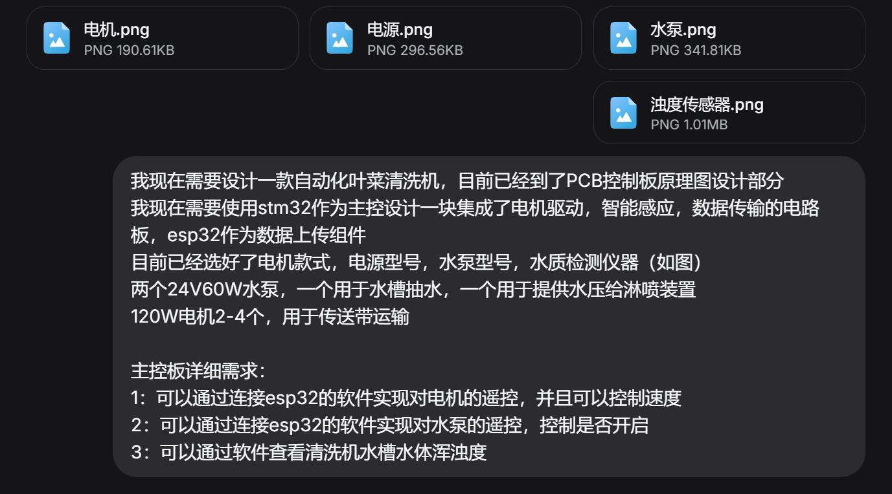
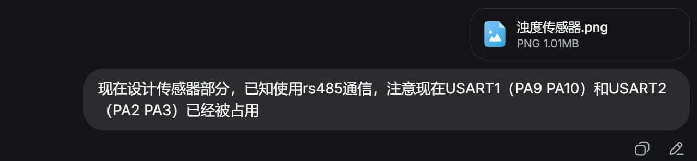

> https://chat.deepseek.com/share/p7v0fe3nfochpkgwf8 Deepseek分享链接，可查看聊天

# AI对话记录




针对您设计的自动化叶菜清洗机，需要基于STM32和ESP32设计一块集电机驱动、传感器采集、数据上传于一体的控制板。以下从系统架构、核心器件选型、电路设计要点、接口定义等方面给出详细原理图设计指导。

------

## 一、系统整体架构

plaintext

```
+----------------+       +------------------+
|   24V 电源     |       |  浊度传感器       |
|   LRS-600-24   |       |  (4-20mA/RS485)  |
+-------+--------+       +--------+---------+
        |                         |
        v                         v
+-------+----------------+--------+---------+
|                      主板                     |
| +------------------+  +-------------------+  |
| | DC-DC降压模块    |  | 4-20mA采样/RS485  |  |
| | 24V -> 5V/3.3V   |  | 接口电路          |  |
| +--------+---------+  +--------+----------+  |
|          |                      |             |
|          v                      v             |
| +----------------+  +----------------------+  |
| | STM32F103RCT6  |<-+-> UART / SPI         |  |
| | 主控           |    | 与ESP32通信         |  |
| +----------------+    +----------------------+  |
|          |                      |             |
|          v                      v             |
| +----------------+  +----------------------+  |
| | 电机驱动模块   |  | 水泵驱动(MOSFET/继电器) |  |
| | (MOSFET H桥)   |  +----------------------+  |
| +----------------+                             |
+-------+----------------------------------------+
        |
        +---- 电机1~4 (24V 120W)
        |
        +---- 水泵1、2 (24V 60W)
```


------

## 二、电源设计

输入：24V/25A（来自LRS-600-24开关电源）

### 1. 控制电路供电

- **DC-DC降压**：选用24V转5V/3A的模块（如LM2596-5.0或MP2307），为STM32、ESP32、传感器、运放等供电。
- **LDO**：5V转3.3V（如AMS1117-3.3），为MCU、RS485芯片等提供稳定3.3V。
- **隔离考虑**：若传感器或通信部分需要隔离，可增加DC-DC隔离模块（如B2405LS-1W），但一般工业应用中非必须。

### 2. 电机/水泵供电

直接取自24V输入，但需在PCB上设置大电流走线，并加装滤波电容（如多个1000µF电解电容并联）以抑制电机启动冲击。

------

## 三、主控芯片选型与最小系统

- **STM32型号**：推荐 **STM32F103RCT6**（LQFP64，256KB Flash，48KB RAM，多个定时器、ADC、UART、SPI等），足以应对多电机PWM控制、传感器采集、与ESP32通信。
- **最小系统**：8MHz晶振（可倍频至72MHz）、复位电路、BOOT设置、SWD调试接口。

------

## 四、电机驱动电路

### 1. 电机参数

- 传送带电机：4个 24V 120W，额定电流约5A，峰值电流可能达10A。
- 水泵电机：2个 24V 60W，额定电流约2.5A，只需开关控制（可PWM调速）。

### 2. 驱动方案

**方案一：分立MOSFET H桥（适合需要正反转及调速的传送带电机）**

- 选用N沟道MOSFET（如IRF3205，Vds=55V，Id=110A，Rds很小），搭配半桥驱动器（如IR2104或IR2110）。每个电机需要一个H桥。
- 保护：在每个半桥上加续流二极管（MOSFET体二极管已够），并可在电源端加TVS吸收尖峰。
- 电流检测：可串接采样电阻或使用霍尔电流传感器（如ACS712）实现过流保护。

**方案二：集成电机驱动模块（简化设计）**

- 使用大电流直流电机驱动芯片，如 **BTN7970**（最大43A，单芯片半桥，需两个组成H桥）或 **VNH3SP30**（全桥集成，最大30A）。但注意散热。
- 对于水泵（仅开关），可用 **MOSFET低边开关**（如IRFZ44N）配合光耦隔离控制，或直接用继电器（但继电器寿命和响应不如MOSFET）。

鉴于您有4个较大功率电机，若PCB空间允许，建议采用分立MOSFET方案，成本低且散热易处理。若追求快速开发，可选用成品电机驱动器模块（如L298N仅支持2A，不够），需选择大功率模块。

### 3. PWM控制

- 所有电机均可通过STM32定时器输出PWM（频率约10~20kHz）控制转速。
- 每个H桥需两个PWM信号（或一个PWM+方向信号），需考虑MCU引脚数量。

------

## 五、水泵驱动电路

水泵只需开关（可加PWM调速以调节流量），建议使用**低边N-MOSFET**驱动：

- 选用 **IRFZ44N**（Vds=55V，Id=49A）或 **IRLB3034**，搭配10~20V栅极驱动（可用MCU直接驱动，但需加栅极电阻和下拉电阻）。
- 光耦隔离：为保护MCU，建议加光耦（如PC817）隔离高压侧，或用MOSFET驱动器（如TC4420）。
- 续流二极管：在电机两端反并快恢复二极管（如1N5824）吸收反向电动势。

------

## 六、浊度传感器接口

### 1. 传感器特性

- 输出：4-20mA模拟量 和 RS485（MODBUS-RTU）。
- 供电：通常需要24V（需确认），可从电源直接取电。

### 2. 4-20mA采集电路

- 使用精密采样电阻（如250Ω，0.1%）将4-20mA转换为1-5V电压，然后输入STM32的ADC。
- 需加运放跟随器（如LM358）进行阻抗匹配和滤波，或直接电阻分压+RC滤波。
- 注意ADC参考电压需稳定（可用外部基准如TL431）。

### 3. RS485通信电路

- 选用 **SP3485** 或 **MAX485** 芯片，3.3V供电，与STM32 UART连接。
- 需加120Ω终端匹配电阻（可焊接或软件使能），A/B线加上下拉电阻（如10kΩ）保证空闲状态。
- 建议用TVS管（如SMBJ6.0A）保护总线。

------

## 七、ESP32接口与通信

- ESP32模块（如ESP32-WROOM-32）通过UART与STM32通信（波特率115200或更高），用于接收控制命令和上传传感器数据。
- 可预留SPI或I2C备用。
- 电源：ESP32需3.3V，电流峰值约500mA，需从5V降压（可用AMS1117-3.3，但注意散热，最好从DC-DC的5V取电）。
- 可增加电平转换（若STM32为5V容忍，则直接连接，否则加电平转换）。

------

## 八、其他必要电路

### 1. 电流检测与保护

- 在每个电机电源回路中串入采样电阻（如5mΩ），通过差分运放（如INA199）放大后送ADC，实现过流保护。
- 也可用集成电流传感器（如ACS712ELCTR-30A-T）。
- 设置比较器硬件快速关断（如LM393），与MCU软件双重保护。

### 2. 温度检测

- 可在MOSFET附近放置NTC热敏电阻，监测温度。

### 3. 按键/指示灯

- 预留本地启停按键、状态LED（电源、运行、故障）。

### 4. 外部接口

- 电机、水泵接线端子（大电流接线端子）。
- 传感器接口（航空插头或端子，带锁扣）。

### 5. 隔离考虑

- 若控制板与高压/大电流部分不隔离，需注意布局分开，地线单点连接。
- 为安全，可考虑将MCU部分与功率部分通过光耦隔离（但会增加成本和复杂度）。

------

## 九、PCB布局与散热

- **分层设计**：功率部分与控制部分分区，避免干扰。
- **大电流走线**：加宽、加厚（2oz铜），并开窗加锡。
- **散热**：MOSFET需配散热片，或利用PCB铜皮散热。
- **电容**：在每个电机驱动电源输入端放置大容量电解电容（如2200µF/50V）和高频瓷片电容（0.1µF）。
- **接口保护**：所有对外接口加ESD/TVS保护。

------

## 十、软件控制逻辑（简述）

1. **STM32**：
   - 初始化PWM、ADC、UART等。
   - 接收ESP32的指令（如电机速度、水泵开关），解析后设置相应PWM占空比或GPIO。
   - 定时采集浊度传感器值（通过ADC或RS485），并发送给ESP32。
   - 监测电流、温度，异常时停机并上报。
2. **ESP32**：
   - 连接WiFi，与云端或手机APP通信。
   - 通过UART与STM32交换数据。
   - 实现远程控制界面。

------

## 十一、原理图设计步骤建议

1. **绘制电源部分**：DC-DC降压、LDO、滤波电容。
2. **绘制STM32最小系统**：晶振、复位、SWD、BOOT。
3. **绘制电机驱动部分**：每个电机一个H桥（或半桥驱动+MOSFET），包括驱动芯片、栅极电阻、续流二极管、电流采样。
4. **绘制水泵驱动部分**：MOSFET低边开关、光耦隔离、续流二极管。
5. **绘制传感器接口**：4-20mA采样电路、RS485芯片及保护。
6. **绘制ESP32接口**：UART连接、电源。
7. **添加保护电路**：过流检测、温度检测、TVS等。
8. **连接所有I/O**：注意引脚分配，避免冲突。
9. **标注网络标号、添加测试点**。

------

## 十二、关键元件选型清单（示例）

| 功能      | 型号/规格             | 数量   | 备注              |
| :-------- | :-------------------- | :----- | :---------------- |
| MCU       | STM32F103RCT6         | 1      | LQFP64            |
| DC-DC     | MP2307 或 LM2596-5.0  | 1      | 24V转5V/3A        |
| LDO       | AMS1117-3.3           | 1      | 5V转3.3V/1A       |
| MOSFET    | IRF3205 (或 IRLB3034) | 4×4=16 | 每个H桥4个        |
| 半桥驱动  | IR2104                | 4×2=8  | 每个H桥两个       |
| 电流检测  | ACS712ELCTR-30A-T     | 4      | 或采样电阻+INA199 |
| 光耦      | PC817                 | 2      | 水泵控制          |
| RS485     | SP3485                | 1      |                   |
| 采样电阻  | 250Ω 0.1%             | 1      | 4-20mA转换        |
| 运放      | LM358                 | 1      | 跟随器            |
| 接线端子  | 大电流（5.08mm间距）  | 若干   | 电机、电源        |
| 电解电容  | 1000µF/50V            | 若干   | 滤波              |
| TVS       | SMBJ30A               | 若干   | 电源保护          |
| ESP32模块 | ESP32-WROOM-32        | 1      |                   |

------

## 十三、注意事项

- 电机驱动部分必须做好**大电流布线**和**散热**，否则容易烧毁。
- 控制信号与功率地需分开，最后单点连接，避免干扰。
- 所有开关器件（MOSFET）必须加足够的栅极电阻（如10~100Ω）以抑制震荡。
- 电源输入端需加保险丝（如30A）和防反接二极管（如大电流肖特基）。
- RS485通信线需双绞屏蔽，并接好地。

以上设计指导可作为您绘制原理图的依据。若需要进一步细化某一部分（如具体H桥电路、PCB布局建议），可随时补充说明。


好的，这是根据您的需求整理的STM32F103RCT6与各外设的引脚级连接关系表。您可以根据此表进行原理图绘制。

这份连接表参考了STM32的通用引脚功能、电机驱动的常见接法以及浊度传感器的接口特性。

### **STM32F103RCT6 引脚连接关系总览**

| **STM32引脚**                       | **引脚功能/复用**   | **连接至**                 | **连接对象引脚/说明**                    |
| :---------------------------------- | :------------------ | :------------------------- | :--------------------------------------- |
| **电源与系统**                      |                     |                            |                                          |
| VDD (9, 24, 36, 48, 56)             | 3.3V电源            | 3.3V                       | 电源输出 (来自LDO)                       |
| VSS (8, 23, 35, 47, 63)             | 地                  | GND                        | 系统地                                   |
| VDDA (13)                           | 模拟3.3V电源        | 3.3V                       | 通过磁珠/电感连接至3.3V，为ADC供电       |
| VSSA (14)                           | 模拟地              | GND                        | 系统地                                   |
| NRST (16)                           | 复位                | 复位按键/调试器            | 低电平复位                               |
| OSC_IN (12)                         | 外部晶振输入        | 8MHz晶振                   | 晶振一端，并接20pF电容到地               |
| OSC_OUT (13)                        | 外部晶振输出        | 8MHz晶振                   | 晶振另一端，并接20pF电容到地             |
| BOOT0 (44)                          | 启动模式选择        | GND或3.3V                  | 通过电阻接地或接高，通常接地从Flash启动  |
| **电机驱动 (MOSFET H桥或驱动芯片)** |                     |                            |                                          |
| PA8                                 | TIM1_CH1 (PWM)      | 电机驱动1                  | PWM/速度控制信号                         |
| PA9                                 | TIM1_CH2 (PWM)      | 电机驱动2                  | PWM/速度控制信号                         |
| PA10                                | TIM1_CH3 (PWM)      | 电机驱动3                  | PWM/速度控制信号                         |
| PA11                                | TIM1_CH4 (PWM)      | 电机驱动4                  | PWM/速度控制信号                         |
| PB6                                 | 通用GPIO            | 电机驱动1                  | 方向控制信号1 (如IN1)                    |
| PB7                                 | 通用GPIO            | 电机驱动1                  | 方向控制信号2 (如IN2)                    |
| PB8                                 | 通用GPIO            | 电机驱动2                  | 方向控制信号1                            |
| PB9                                 | 通用GPIO            | 电机驱动2                  | 方向控制信号2                            |
| PB0                                 | 通用GPIO            | 电机驱动3                  | 方向控制信号1                            |
| PB1                                 | 通用GPIO            | 电机驱动3                  | 方向控制信号2                            |
| PB10                                | 通用GPIO            | 电机驱动4                  | 方向控制信号1                            |
| PB11                                | 通用GPIO            | 电机驱动4                  | 方向控制信号2                            |
| **水泵控制 (MOSFET低边开关)**       |                     |                            |                                          |
| PA6                                 | 通用GPIO            | 水泵1 MOSFET               | 通过光耦或驱动电路连接MOSFET栅极         |
| PA7                                 | 通用GPIO            | 水泵2 MOSFET               | 通过光耦或驱动电路连接MOSFET栅极         |
| **浊度传感器 (4-20mA模式)**         |                     |                            |                                          |
| PA1                                 | ADC1_IN1 (模拟输入) | 浊度传感器信号调理电路输出 | 采集经IV转换和滤波后的电压信号 (1-5V)    |
| **浊度传感器 (RS485模式)**          |                     |                            |                                          |
| PB10                                | USART3_TX           | RS485芯片 (如SP3485)       | DI (发送数据输入) 引脚                   |
| PB11                                | USART3_RX           | RS485芯片 (如SP3485)       | RO (接收数据输出) 引脚                   |
| PB12                                | 通用GPIO            | RS485芯片 (如SP3485)       | RE/DE (接收/发送使能) 引脚，控制收发方向 |
| **ESP32 通信**                      |                     |                            |                                          |
| PA9                                 | USART1_TX           | ESP32                      | UART RX (接收引脚)                       |
| PA10                                | USART1_RX           | ESP32                      | UART TX (发送引脚)                       |
| **调试接口 (SWD)**                  |                     |                            |                                          |
| PA13                                | SWDIO               | SWD调试接口                | 数据线                                   |
| PA14                                | SWCLK               | SWD调试接口                | 时钟线                                   |
| **预留/备用接口**                   |                     |                            |                                          |
| PB6                                 | I2C1_SCL            | 预留                       | 可用于连接其他I2C传感器                  |
| PB7                                 | I2C1_SDA            | 预留                       | 可用于连接其他I2C传感器                  |
| **其他**                            |                     |                            |                                          |
| PC13                                | 通用GPIO            | 状态LED                    | 通过限流电阻连接LED指示灯                |

### **设计要点与补充说明**

1. **电源与地线**
   - **模拟地与数字地**：`VSSA` (Pin 14) 是STM32的模拟地，应通过一个0Ω电阻或磁珠在一点处与数字地（`VSS`）连接。浊度传感器采集电路的参考地也应连接到模拟地，以减少数字噪声对模拟信号的影响 。
   - **去耦电容**：在每个`VDD`引脚附近就近放置一个0.1µF的陶瓷电容，并在主电源输入处放置一个10µF的钽电容或电解电容，以保证电源稳定 。
2. **电机驱动接口**
   - **PWM引脚**：这里选用的PA8-PA11属于高级定时器TIM1，非常适合产生电机控制的PWM信号 。请务必在单片机固件中正确配置这些引脚为复用推挽输出模式。
   - **方向引脚**：方向控制引脚（PB6-PB11等）可根据您的实际电路设计进行调整，只要在代码中对应即可 。
   - **隔离与保护**：强烈建议在STM32的GPIO与电机驱动电路之间增加隔离（如使用光耦）。如果驱动芯片自带隔离或逻辑电平兼容，则可不加，但需确保两者共地。
3. **浊度传感器接口**
   - **4-20mA信号**：传感器输出的是4-20mA电流信号，需经过一个**高精度采样电阻**（例如250Ω，0.1%）将其转换为1-5V电压信号，再输入到`PA1`引脚。为确保ADC采样精度，可以在`PA1`引脚前添加一个由运放（如LM358）构成的电压跟随器进行阻抗变换和滤波 。
   - **RS485通信**：STM32的`PB10`(TX)、`PB11`(RX)和`PB12`(控制)需连接到RS485收发芯片（如SP3485），再由该芯片连接到传感器的RS485总线 。
4. **ESP32通信**
   - **电平匹配**：STM32和ESP32的UART引脚通常都是3.3V逻辑电平，可以直接连接。如果通信不稳定，可以串联一个330Ω的电阻。
   - **共地**：两块板卡之间必须共地，即STM32的`GND`与ESP32的`GND`相连。
5. **水泵控制**
   - **驱动电路**：`PA6`和`PA7`输出高电平或PWM信号，用于控制MOSFET（如IRFZ44N）的导通与关断。为确保安全，应在GPIO和MOSFET栅极之间增加光耦（如PC817）进行隔离，并在MOSFET源极和漏极间反向并联续流二极管以吸收水泵断电时产生的反向电动势。

这份连接表为您绘制原理图提供了详细的引脚对应关系。建议您在实际设计时，结合所选具体型号的驱动芯片、传感器等数据手册进行复核，确保信号方向和电平匹配。


好的，我们先集中精力把系统的“心脏”——电源部分设计好。一个稳定、干净的电源是整块控制板正常工作的基础。根据你的需求，我将电源部分的设计分为三个清晰的层级，并为你选择了具体的元件和接线方式。

### 自动化叶菜清洗机控制板 - 电源部分设计

#### 整体电源架构图

下图展示了电源从总闸到各个芯片的流向，可以帮你先建立一个整体概念。


接下来，我们按照这个流向，详细介绍每个部分用到的元件和它们之间的具体接线方法。

------

### 第一部分：24V 总动力电源

这一级是系统的能量来源，我们已经选定了**明纬 LRS-600-24** 开关电源。

- **元件清单**：
  1. 明纬 LRS-600-24 开关电源 (600W, 24V/25A输出)
  2. 交流电源线 (带插头)
  3. 合适的接线端子或大电流端子排
  4. 总电源开关 (可选，但强烈建议)
  5. 保险丝 (可选，但强烈建议，30A慢断型)
- **接线关系**：
  1. **输入侧 (接交流电)**：
     - 将交流电源线（L-火线, N-零线, E/G-地线）连接到电源的对应输入端子上。
     - **【重要操作】**：在上电前，务必检查电源侧面的输入电压切换开关，并将其拨到与当地电网匹配的档位（例如，在中国是 `230V` 或 `220V`）。如果开关位置错误，通电即会损坏电源。
  2. **输出侧 (接控制板)**：
     - 使用合适线径（例如 2.5mm² 或更粗）的电线，将电源的 `+V` (正极) 和 `-V` (负极/COM) 连接到控制板上的 **24V 电源输入端子排**。
     - **注意**：`-V` 是24V的负极，在控制板上将作为 **功率地**，与后续的5V/3.3V的**信号地**严格分开，最后单点连接。

------

### 第二部分：5V 中间总线电源

24V电压太高，无法直接给单片机等芯片供电，我们需要一个降压芯片先将24V降到5V。这里我们选择经典的 **LM2596-5.0** DC-DC降压芯片。

- **元件清单**：
  1. **U1 (核心芯片)**：LM2596SX-5.0/NOPB (TO-263封装，固定5V输出版本)
  2. **D1 (续流二极管)**：1N5824 (肖特基二极管，3A/40V)
  3. **L1 (储能电感)**：68µH / 3A 功率电感
  4. **CIN (输入滤波电容)**：220µF / 50V 铝电解电容
  5. **COUT (输出滤波电容)**：470µF / 25V 铝电解电容
  6. **CF (旁路电容)**：0.1µF (104) 陶瓷电容 (用于滤除高频噪声)
- **接线关系 (原理图连接)**：
  1. **输入端**：
     - 从24V端子排引入的 `+24V`，连接到 U1 的 `Vin` (引脚1)。
     - 从24V端子排引入的 `GND_PWR` (功率地)，连接到 U1 的 `GND` (引脚3) 和输入电容 CIN 的负极。
     - 将输入滤波电容 CIN (220µF/50V) 的正极连接到 `+24V`，负极连接到 `GND_PWR`。电容必须紧靠U1的输入引脚放置。
  2. **输出端 (核心连接)**：
     - U1 的 `Output` (引脚2) 连接到 **L1 (68µH电感)** 的一端。
     - L1 的另一端，即为 **5V 输出总线 (VCC_5V)**。
     - 将续流二极管 D1 (1N5824) 的阴极（有横杠的一端）连接到 U1 的 `Output` 引脚（即L1之前）。
     - 将 D1 的阳极连接到 `GND_PWR`。
  3. **滤波**：
     - 在 **5V 输出总线 (VCC_5V)** 与 `GND_PWR` 之间，并联输出电容 COUT (470µF/25V)，正极接5V，负极接地。
     - 同样在5V与地之间，并联一个陶瓷电容 CF (0.1µF)，用于滤除高频噪声。这个电容要尽量靠近后面要连接的负载。

------

### 第三部分：3.3V 核心逻辑电源

5V电压对于STM32和ESP32来说还是太高了，需要进一步降压到3.3V。对于电流要求相对较小且对稳定性要求高的数字电路，我们使用低压差线性稳压器（LDO）**AMS1117-3.3**。

- **元件清单**：
  1. **U2 (核心芯片)**：AMS1117-3.3 (SOT-223或TO-252封装)
  2. **CIN2 (输入滤波电容)**：10µF / 16V 钽电容或电解电容
  3. **COUT2 (输出滤波电容)**：10µF / 6.3V 钽电容
  4. **COUT3 (旁路电容)**：0.1µF (104) 陶瓷电容
- **接线关系 (原理图连接)**：
  1. **输入端**：
     - U2 的 `Vin` (引脚3) 连接到上一级产生的 **VCC_5V** 总线。
     - 在 U2 的 `Vin` 和 `GND` (引脚1) 之间，就近并联输入电容 CIN2 (10µF/16V)，正极接5V，负极接地。这个电容用于稳定输入。
  2. **输出端**：
     - U2 的 `Vout` (引脚2) 即为 **3.3V 输出总线 (VCC_3V3)**。
     - 在 `Vout` 和 `GND` 之间，就近并联输出电容 COUT2 (10µF/6.3V) 和 COUT3 (0.1µF 陶瓷电容)。
  3. **地线**：
     - U2 的 `GND` (引脚1) 连接到 **信号地 (GND)**。**注意**：这个信号地最终要通过磁珠或0欧电阻，在一点上与前面的功率地 `GND_PWR` 连接。

------

### 电源部分接线总结

为了方便你画原理图，这里是一个简洁的元件连接清单：

- **J1 (24V输入端子)**:
  - Pin 1 (+24V) -> **CIN (220µF) 正极**, **U1 (LM2596) Vin**, **电机/水泵电源正极**
  - Pin 2 (GND_PWR) -> **CIN 负极**, **U1 GND**, **D1 (1N5824) 阳极**, **电机/水泵电源负极**
- **U1 (LM2596-5.0)**:
  - Vin (Pin1) -> +24V
  - Output (Pin2) -> **L1 (68µH)** 一端
  - GND (Pin3) -> GND_PWR
- **L1 (68µH)**:
  - 一端 -> U1 Output
  - 另一端 -> **VCC_5V 总线**, **COUT (470µF) 正极**, **CF (0.1µF)**, **U2 (AMS1117) Vin**
- **U2 (AMS1117-3.3)**:
  - Vin (Pin3) -> VCC_5V, **CIN2 (10µF) 正极**
  - Vout (Pin2) -> **VCC_3V3 总线**, **COUT2 (10µF) 正极**, **COUT3 (0.1µF)**
  - GND (Pin1) -> **信号地 (GND)**

### 关键注意事项

1. **地线处理**：这是最关键的一步。整个板子上会有两个“地”：一个是处理24V/5V大电流的**功率地 (GND_PWR)**，一个是处理3.3V小信号的**信号地 (GND)**。在原理图和PCB布局中，它们必须严格分开，最后只在电源输入处通过一个**0欧电阻**或**磁珠**单点连接。这样可以有效防止电机的大电流干扰MCU的正常工作。
2. **电容摆放**：所有的滤波电容，特别是小容值的陶瓷电容（如0.1µF），在PCB布局时必须**尽可能靠近**所对应芯片的电源引脚，否则滤波效果会大打折扣。
3. **散热**：LM2596在将24V降压到5V且输出电流较大时，可能会有一定的发热。在设计PCB时，需要为它和附近的功率器件（如MOSFET）留出足够的散热面积或安装散热片。

电源部分的框架搭好后，下一步就可以基于这个基础，连接STM32、电机驱动和传感器了。你是想继续设计这部分，还是有其他更关注的功能模块？


好的，我们开始设计STM32F103RCT6部分。这是控制板的大脑，负责电机PWM控制、传感器数据采集、与ESP32通信等任务。我将按照最小系统、电机驱动接口、水泵接口、浊度传感器接口、ESP32通信接口的顺序，给出详细的原理图连接方式。

## 一、STM32F103RCT6 最小系统电路

### 1. 电源与去耦

STM32需要两组电源：数字部分（VDD/VSS）和模拟部分（VDDA/VSSA）。模拟电源需单独滤波以提高ADC精度。

| STM32引脚         | 信号名  | 连接方式                                                     |
| :---------------- | :------ | :----------------------------------------------------------- |
| 9, 24, 36, 48, 56 | VDD_3V3 | 连接到3.3V电源总线（VCC_3V3）                                |
| 8, 23, 35, 47, 63 | VSS     | 连接到数字地（GND）                                          |
| 13                | VDDA    | 通过磁珠（如BLM21PG221SN1）连接到VCC_3V3，并就近对地接0.1µF + 10µF电容 |
| 14                | VSSA    | 连接到模拟地（GND_ANA），模拟地通过0Ω电阻单点连接到数字地    |
| 6                 | VBAT    | 若使用备用电池（RTC用），接3V纽扣电池正极；否则直接接VCC_3V3 |

**去耦电容**：在每个VDD引脚附近放置一个0.1µF陶瓷电容，电容另一端直接接到最近的地平面。在电源入口处（如VCC_3V3进入STM32区域）放置一个10µF钽电容。

### 2. 外部晶振（HSE）

使用8MHz晶体为系统提供精确时钟源。

| STM32引脚                                         | 信号名  | 连接方式                                           |
| :------------------------------------------------ | :------ | :------------------------------------------------- |
| 12                                                | OSC_IN  | 连接到8MHz晶振（如HC-49S）一端，并经过20pF电容到地 |
| 13                                                | OSC_OUT | 连接到8MHz晶振另一端，并经过20pF电容到地           |
| 注意：引脚13同时也是OSC_OUT/PD1，需确保配置正确。 |         |                                                    |

### 3. 复位电路

| STM32引脚 | 信号名 | 连接方式                                                     |
| :-------- | :----- | :----------------------------------------------------------- |
| 16        | NRST   | 接上拉电阻10kΩ到VCC_3V3，并接一个按键到地，同时并联0.1µF电容（可选，防抖动） |

### 4. BOOT模式选择

| STM32引脚 | 信号名 | 连接方式                                                     |
| :-------- | :----- | :----------------------------------------------------------- |
| 44        | BOOT0  | 通过10kΩ电阻接地（从Flash启动）或接3.3V（用于ISP下载）。建议加一个2Pin跳线帽，以便切换。 |
| 37        | BOOT1  | 内部已下拉，可直接悬空                                       |

### 5. 调试接口（SWD）

| STM32引脚 | 信号名       | 连接方式                                                  |
| :-------- | :----------- | :-------------------------------------------------------- |
| 55        | PA13 (SWDIO) | 连接到调试器SWDIO接口，并上拉10kΩ到VCC_3V3                |
| 49        | PA14 (SWCLK) | 连接到调试器SWCLK接口，并下拉10kΩ到地（可选，增强抗干扰） |
| -         | NRST         | 也可连接到调试器nRST（可选）                              |

## 二、电机驱动接口

您计划使用4个120W电机，每个电机需要一个H桥（或集成驱动器）。这里以分立MOSFET H桥+IR2104半桥驱动为例，说明STM32与驱动器的连接。

每个电机需要两个PWM信号（或一个PWM+一个方向），以及两个方向控制信号（若使用半桥驱动则每个半桥需一个PWM输入，但通常集成驱动芯片如IR2104只需要一个PWM和一个方向控制输入）。我们采用常用的PWM+方向控制方式：一个PWM引脚控制速度，两个GPIO控制正反转（H桥上下桥臂的使能逻辑）。

### 引脚分配（以电机1为例）

| STM32引脚 | 信号名         | 连接至                                        | 说明           |
| :-------- | :------------- | :-------------------------------------------- | :------------- |
| PA8       | TIM1_CH1 (PWM) | 电机驱动1 PWM输入（如IR2104的IN引脚）         | 速度控制       |
| PB6       | GPIO           | 电机驱动1 方向A（如IR2104的SD引脚或逻辑输入） | 例如高电平正转 |
| PB7       | GPIO           | 电机驱动1 方向B（如IR2104的另一个逻辑输入）   | 例如高电平反转 |

**电机2、3、4依次类推**：

- 电机2：PA9 (PWM), PB8, PB9
- 电机3：PA10 (PWM), PB0, PB1
- 电机4：PA11 (PWM), PB10, PB11

**注意事项**：

- PA8~PA11属于高级定时器TIM1，可产生独立4路PWM，互补输出等。若不需要互补，可配置为独立PWM模式。
- 如果驱动芯片需要5V逻辑电平，需在STM32输出与驱动之间加电平转换（如使用74LVC4245或简单三极管电平转换）。但多数现代驱动芯片可直接接受3.3V逻辑，请确认所选驱动芯片的数据手册。
- 为保护MCU，建议在GPIO与驱动芯片之间串联100Ω电阻，并考虑使用光耦隔离（特别是功率部分与MCU不共地时）。

## 三、水泵控制接口

水泵为2个24V 60W直流电机，只需开关控制（可PWM调速）。采用低边N-MOSFET驱动，通过光耦隔离控制。

### 引脚分配

| STM32引脚 | 信号名 | 连接至                                 | 说明      |
| :-------- | :----- | :------------------------------------- | :-------- |
| PA6       | GPIO   | 光耦1（如PC817）输入端（串联限流电阻） | 控制水泵1 |
| PA7       | GPIO   | 光耦2（如PC817）输入端（串联限流电阻） | 控制水泵2 |

**具体连接**：

- STM32 GPIO（3.3V）通过一个330Ω电阻连接到光耦的LED阳极，光耦LED阴极接地。
- 光耦输出侧（三极管集电极）接12V/24V上拉电阻（如10kΩ）到驱动电源，并连接到MOSFET栅极（需加栅极驱动电阻）。光耦发射极接地。
- 这样当GPIO输出高电平时，光耦导通，MOSFET栅极被拉低，MOSFET关断；GPIO低电平时，光耦不导通，栅极被上拉电阻拉高，MOSFET导通。若逻辑相反，可在软件中调整。

若希望水泵可调速，可将PA6/PA7配置为PWM输出，同样通过光耦控制MOSFET，即可实现PWM调速。

## 四、浊度传感器接口

传感器有两种输出方式：4-20mA模拟量和RS485数字量。建议同时设计两种接口，用户可根据传感器型号选择连接。

### 4-20mA模拟接口

| STM32引脚 | 信号名   | 连接至           | 说明         |
| :-------- | :------- | :--------------- | :----------- |
| PA1       | ADC1_IN1 | 信号调理电路输出 | 采集电压信号 |

**信号调理电路**：

- 传感器4-20mA电流输出 -> 精密采样电阻（如250Ω 0.1%） -> 电压信号1-5V。
- 该电压信号经运放（如LM358）电压跟随器进行阻抗变换，并添加低通滤波（RC滤波，例如R=1kΩ，C=0.1µF）后送入PA1。
- 注意运放供电需单电源5V（可从VCC_5V取电），且输入电压范围需覆盖1-5V。
- 采样电阻后需对地并联TVS管（如SMBJ6.0A）进行过压保护。

### RS485数字接口

| STM32引脚 | 信号名    | 连接至                           | 说明                                 |
| :-------- | :-------- | :------------------------------- | :----------------------------------- |
| PB10      | USART3_TX | RS485芯片（如SP3485）的DI引脚    | 发送数据                             |
| PB11      | USART3_RX | RS485芯片的RO引脚                | 接收数据                             |
| PB12      | GPIO      | RS485芯片的RE/DE引脚（合并控制） | 控制收发方向：高电平发送，低电平接收 |

**RS485电路**：

- RS485芯片（如SP3485）的VCC接3.3V，GND接GND。
- A/B线之间跨接120Ω终端匹配电阻（可通过跳线选择是否接入）。
- A线上拉4.7kΩ到3.3V，B线下拉4.7kΩ到GND，保证空闲状态。
- A/B线对地接TVS管（如SMBJ6.0A）防静电/浪涌。

**连接至传感器**：通过接线端子引出A、B线，连接到传感器的RS485接口。

## 五、ESP32通信接口

STM32通过UART与ESP32通信。两者均为3.3V逻辑，可直接连接。

| STM32引脚 | 信号名    | 连接至        | 说明            |
| :-------- | :-------- | :------------ | :-------------- |
| PA9       | USART1_TX | ESP32 UART RX | 发送数据到ESP32 |
| PA10      | USART1_RX | ESP32 UART TX | 接收ESP32数据   |
| GND       | GND       | ESP32 GND     | 共地            |

**注意事项**：

- 可在TX/RX线上串联100Ω电阻，以限制电流和抑制反射。
- 如果ESP32模块工作电流较大，需确保3.3V电源能提供足够电流（AMS1117-3.3最大输出1A，若ESP32+STM32+其他3.3V器件总电流超过1A，需更换更大电流LDO或使用DC-DC直接输出3.3V）。
- 若ESP32需单独供电，可考虑在板上为ESP32预留电源焊点，并从VCC_3V3取电。

## 六、其他可选接口

### 状态指示灯

| STM32引脚 | 信号名 | 连接至                  | 说明              |
| :-------- | :----- | :---------------------- | :---------------- |
| PC13      | GPIO   | LED（串联限流电阻330Ω） | 电源/运行状态指示 |

### 本地按键（可选）

| STM32引脚 | 信号名               | 连接至                         | 说明               |
| :-------- | :------------------- | :----------------------------- | :----------------- |
| PA0       | GPIO（可配置为EXTI） | 按键一端，另一端接地，内部上拉 | 用于本地启停或调试 |

## 七、PCB布局布线提示

1. **晶振电路**：晶振和负载电容尽量靠近STM32的OSC_IN/OUT引脚，走线尽可能短且包地，避免高频干扰。
2. **去耦电容**：每个VDD引脚旁的0.1µF电容必须紧靠引脚，过孔直接连接到地和电源层。
3. **模拟部分**：模拟电源VDDA和模拟地VSSA的走线独立，避免数字噪声耦合。ADC输入走线远离高频数字信号。
4. **功率与信号隔离**：电机驱动、水泵驱动等大电流回路与STM32部分在布局上分区，地平面分割，最后单点连接。
5. **调试接口**：SWD接口留出排针，便于下载和调试。

以上连接关系已覆盖您需求中的主要部分。您可以根据此详细说明绘制原理图，如有具体芯片选型疑问，可进一步提供型号以便确认兼容性。


好的，我们来重点攻克电机驱动部分。这是整个控制板中功率最大、设计最关键的环节。

根据您的需求（4个120W/24V直流电机，需要正反转和调速），最经典可靠的方案是**N沟道MOSFET H桥 + 专用栅极驱动器**。下面我详细讲解每个元件的选型、作用和连接方式。

## 一、方案选择：分立H桥 vs 集成驱动

针对您的4个120W电机，有两种主流实现方式：

| 方案             | 核心元件                     | 优点                             | 缺点              | 适用场景         |
| :--------------- | :--------------------------- | :------------------------------- | :---------------- | :--------------- |
| **分立H桥**      | 驱动器(如IR2104)+4个N-MOSFET | 成本低、散热好、电流能力强、灵活 | 元件多、PCB面积大 | 大功率、批量生产 |
| **集成驱动芯片** | 如BTN7970、VNH3SP30          | 集成度高、设计简单、保护完善     | 成本高、散热受限  | 快速原型、小批量 |

我建议采用**分立H桥方案**，成本可控且适合120W功率级别。下面以**IR2104半桥驱动器**为例详细说明。

## 二、单个电机的H桥驱动电路详解

每个电机需要一套独立的H桥电路。以下是完整的原理图设计：

### 1. 核心芯片：IR2104S 半桥驱动器

IR2104是专门用于驱动MOSFET半桥的芯片，具有以下特性：

- **高侧浮动电源**：通过自举电路工作，无需独立隔离电源
- **兼容3.3V逻辑**：可直接连接STM32的GPIO
- **死区时间内置**：防止上下桥臂直通短路
- **峰值驱动电流**：2.5A，可快速充放MOSFET栅电容

**引脚功能与连接**：

| IR2104引脚 | 引脚名 | 功能                   | 连接目标                      |
| :--------- | :----- | :--------------------- | :---------------------------- |
| 1          | VCC    | 芯片供电               | +12V（来自电源部分）          |
| 2          | IN     | PWM输入                | STM32的PWM引脚（如PA8）       |
| 3          | SD     | 关断控制（低电平有效） | STM32的GPIO或直接拉高         |
| 4          | COM    | 地                     | 功率地（GND_PWR）             |
| 5          | LO     | 低侧MOSFET驱动输出     | 下桥MOSFET栅极（通过电阻）    |
| 6          | VS     | 高侧源极反馈           | 连接H桥输出点（两MOSFET中点） |
| 7          | HO     | 高侧MOSFET驱动输出     | 上桥MOSFET栅极（通过电阻）    |
| 8          | VB     | 高侧自举电源           | 自举电容正极                  |

### 2. 功率MOSFET选型：IRF3205

根据您的24V/120W电机，额定电流约5A，但启动和堵转时可能达15-20A。**IRF3205**是理想选择：

- **VDS = 55V**：足够24V系统余量
- **RDS(on) = 8mΩ**：极低导通电阻，发热小
- **ID = 110A**：远超需求，可靠性高
- **TO-220封装**：便于散热

每个H桥需要4个IRF3205（Q1上桥、Q2下桥为A桥臂；Q3上桥、Q4下桥为B桥臂）。

### 3. 自举电路设计

IR2104驱动上桥MOSFET需要自举电路提供浮动电源：

- **自举电容C_BOOT**：10µF~47µF，50V陶瓷电容
  - 连接在VB（引脚8）和VS（引脚6）之间
  - 容量选择：C = (Qg × 10) / ΔV，其中Qg为MOSFET栅电荷
- **自举二极管D_BOOT**：UF4007或1N4148快恢复二极管
  - 阳极接+12V，阴极接自举电容正极
  - 防止高压倒灌

**工作原理**：当下桥MOSFET导通时，VS被拉到地，+12V通过D_BOOT给C_BOOT充电至约11.3V（扣除二极管压降）。当需要导通上桥时，C_BOOT的负极（VS）被抬高到电源电压（24V），C_BOOT正极（VB）则被抬升到24V+11.3V=35.3V，为上桥提供足够的栅极驱动电压。

### 4. 栅极驱动电阻

在IR2104输出（HO/LO）与MOSFET栅极之间串联电阻，作用是限制栅极充电电流、抑制振铃：

- **RG_on**：10Ω~22Ω（开通电阻）
- **RG_off**：可并联二极管加快关断

建议：先串10Ω，预留位置，调试时根据波形调整。

### 5. 续流二极管

虽然MOSFET内部有体二极管，但大电流应用建议外加强力续流二极管：

- **MBR20100CT**（20A/100V肖特基）或类似
- 每个MOSFET并联一个，阴极接漏极，阳极接源极
- 作用：在MOSFET关断时提供电流通路，防止反电动势击穿

### 6. 电源滤波

在每个H桥的电源输入端（+24V和GND_PWR之间）放置：

- **大电解电容**：1000µF/50V，吸收低频波动
- **高频陶瓷电容**：0.1µF~1µF，滤除高频噪声
- 位置尽量靠近MOSFET漏极

## 三、完整H桥电路连接图（单个电机）

下面以电机1为例，给出完整的网络连接表：

| 元件            | 引脚/端点 | 连接至                        | 说明                   |
| :-------------- | :-------- | :---------------------------- | :--------------------- |
| **U1 (IR2104)** | 1 (VCC)   | +12V                          | 驱动器供电             |
|                 | 2 (IN)    | STM32 PA8 (TIM1_CH1)          | PWM速度控制            |
|                 | 3 (SD)    | +3.3V (通过10kΩ上拉)          | 始终使能，或接GPIO控制 |
|                 | 4 (COM)   | GND_PWR                       | 功率地                 |
|                 | 5 (LO)    | 10Ω电阻→Q2栅极                | 驱动下桥Q2             |
|                 | 6 (VS)    | Q1源极/Q2漏极连接点 (MOTOR_A) | H桥输出点A             |
|                 | 7 (HO)    | 10Ω电阻→Q1栅极                | 驱动上桥Q1             |
|                 | 8 (VB)    | 自举电容正极                  |                        |

| **功率部分** | | | |
| Q1 (IRF3205) | 漏极(D) | +24V | 上桥A |
| | 源极(S) | MOTOR_A节点 | 接电机一端 |
| | 栅极(G) | 10Ω→U1 HO | |
| Q2 (IRF3205) | 漏极(D) | MOTOR_A节点 | 下桥A |
| | 源极(S) | GND_PWR | 功率地 |
| | 栅极(G) | 10Ω→U1 LO | |
| Q3 (IRF3205) | 漏极(D) | +24V | 上桥B（另一半桥需另一个IR2104） |
| | 源极(S) | MOTOR_B节点 | 接电机另一端 |
| | 栅极(G) | 10Ω→U2 HO | |
| Q4 (IRF3205) | 漏极(D) | MOTOR_B节点 | 下桥B |
| | 源极(S) | GND_PWR | |
| | 栅极(G) | 10Ω→U2 LO | |

| **自举电路** | | | |
| C_BOOT | 正极 | U1 VB (8) | 10~47µF/50V陶瓷 |
| | 负极 | U1 VS (6) | |
| D_BOOT | 阳极 | +12V | UF4007 |
| | 阴极 | U1 VB | |

| **电机接口** | | | |
| J_MOTOR1 | 引脚1 | MOTOR_A节点 | 接电机正极（定义正转方向） |
| | 引脚2 | MOTOR_B节点 | 接电机负极 |

## 四、电机2、3、4的扩展

按照同样方式复制三份，只需要更改STM32的PWM引脚和控制引脚：

| 电机  | PWM引脚         | 半桥A驱动   | 半桥B驱动   | 说明                |
| :---- | :-------------- | :---------- | :---------- | :------------------ |
| 电机1 | PA8 (TIM1_CH1)  | U1 (IR2104) | U2 (IR2104) | 两个半桥组成一个H桥 |
| 电机2 | PA9 (TIM1_CH2)  | U3 (IR2104) | U4 (IR2104) |                     |
| 电机3 | PA10 (TIM1_CH3) | U5 (IR2104) | U6 (IR2104) |                     |
| 电机4 | PA11 (TIM1_CH4) | U7 (IR2104) | U8 (IR2104) |                     |

每个电机需要两个IR2104（共8个），每个IR2104驱动一对MOSFET。

## 五、电流检测与保护电路

为每个电机增加过流保护，防止堵转烧毁：

### 方案：低侧采样电阻 + 差分放大器

| 元件            | 连接                           | 说明            |
| :-------------- | :----------------------------- | :-------------- |
| R_sense         | 一端接Q2/Q4源极，一端接GND_PWR | 5mΩ/3W 精密电阻 |
| INA199 或 LM358 | 输入接R_sense两端              | 放大50~100倍    |
| 输出            | 接STM32 ADC (如PA1)            | 实时监测电流    |

**保护逻辑**：当ADC检测到电流超过设定阈值（如15A）时，立即将对应电机的SD引脚拉低，关断驱动。

## 六、PCB布局关键要点

1. **功率走线加宽**：24V和GND_PWR走线宽度至少3mm以上（2oz铜箔），可承载10A以上电流。
2. **驱动器靠近MOSFET**：IR2104输出到MOSFET栅极走线尽量短（<2cm），减少寄生电感。
3. **大电容就近放置**：1000µF电解电容紧靠H桥电源输入端。
4. **功率地与信号地分离**：所有MOSFET源极、大电容负极、IR2104 COM脚连接到一个独立的功率地层，最后通过单点（0Ω电阻/磁珠）连接到STM32信号地。
5. **散热设计**：IRF3205 TO-220需安装散热片，若PCB空间有限，可考虑DPAK贴片封装并加大铜箔面积。

## 七、元器件清单（单个电机）

| 类别       | 元件      | 型号/规格             | 数量 |
| :--------- | :-------- | :-------------------- | :--- |
| 驱动器     | U1, U2    | IR2104S (SOIC-8)      | 2    |
| MOSFET     | Q1~Q4     | IRF3205 (TO-220)      | 4    |
| 自举电容   | C_BOOT1,2 | 10µF/50V 陶瓷         | 2    |
| 自举二极管 | D_BOOT1,2 | UF4007                | 2    |
| 栅极电阻   | RG1~RG4   | 10Ω 1/4W              | 4    |
| 续流二极管 | D1~D4     | MBR20100CT (或肖特基) | 4    |
| 电源滤波   | C_BULK    | 1000µF/50V 电解       | 1    |
| 电源滤波   | C_HF      | 0.1µF 陶瓷            | 若干 |
| 电流采样   | R_sense   | 5mΩ 3W                | 1    |
| 电流放大器 | U3        | INA199 或 LM358       | 1    |

以上是单个H桥的完整设计，4个电机需4套。如需我画出具体的原理图连线草图，或者对某个部分有疑问，请随时提出。


好的，采用集成驱动芯片的方案确实能大大简化电路设计并节省PCB空间。针对您的4个120W/24V电机（额定电流约5A，峰值可达10-15A），我推荐使用**英飞凌BTN7970B**或**意法半导体VNH3SP30**这两款经典的集成H桥驱动芯片。

## 一、集成驱动芯片选型推荐

| 型号         | 制造商 | 电压范围 | 持续电流        | 峰值电流 | 导通电阻 | 封装            | 特点                             |
| :----------- | :----- | :------- | :-------------- | :------- | :------- | :-------------- | :------------------------------- |
| **BTN7970B** | 英飞凌 | 5.5-28V  | 约20A（需散热） | 70A      | **16mΩ** | TO-263-7        | 导通电阻极低、发热小、带电流检测 |
| **VNH3SP30** | 意法   | 5.5-36V  | 30A             | 40A      | 19mΩ     | MultiPowerSO-30 | 输出电流大、保护完善             |
| SS6548D      | 国产   | 6.5-40V  | 8A              | 16A      | 45mΩ     | DFN5×5          | 封装极小，但电流能力偏小         |
| DIA58243     | 帝奥微 | 4.5-35V  | 12A             | -        | 84mΩ     | QFN-14          | 封装极小，适合空间受限           |

**推荐首选：BTN7970B**，因为它：

- 导通电阻仅16mΩ，发热量最小 
- 单芯片集成P-MOS高边+N-MOS低边+驱动IC，无需电荷泵，EMI低 
- 内置电流检测功能，可直接读取电机电流 
- 可直接3.3V逻辑控制，无需电平转换

## 二、BTN7970B 引脚功能与连接

### 芯片引脚定义（TO-263-7封装）

| 引脚号 | 引脚名 | 功能                       | 连接目标                    |
| :----- | :----- | :------------------------- | :-------------------------- |
| 1      | GND    | 地                         | 功率地 (GND_PWR)            |
| 2      | IN     | 控制输入（高电平导通高边） | STM32 GPIO（PWM引脚）       |
| 3      | INH    | 使能（高电平使能）         | STM32 GPIO 或 直接接3.3V    |
| 4      | SR     | 压摆率调节                 | 通过电阻（0-51kΩ）到地      |
| 5      | IS     | 电流检测/故障标志          | STM32 ADC引脚，通过电阻上拉 |
| 6      | VS     | 电源                       | +24V（并联大电容）          |
| 7      | OUT    | 输出                       | 接电机一端                  |

## 三、单个BTN7970B的完整电路设计

### 1. 核心连接（每个电机需要2片BTN7970B组成H桥）

| 元件                      | 引脚/端点 | 连接至                             | 说明                   |
| :------------------------ | :-------- | :--------------------------------- | :--------------------- |
| **U1 (BTN7970B - 高侧A)** |           |                                    |                        |
|                           | 1 (GND)   | GND_PWR                            | 功率地                 |
|                           | 2 (IN)    | STM32 PWM1 (如PA8)                 | 通过10kΩ串联电阻       |
|                           | 3 (INH)   | STM32 GPIO (如PB6) 或 +3.3V        | 高电平使能，可共用控制 |
|                           | 4 (SR)    | 通过10kΩ电阻到GND                  | 调节开关速度，优化EMI  |
|                           | 5 (IS)    | 通过1kΩ电阻到+3.3V，并接STM32 ADC1 | 电流检测/故障输出      |
|                           | 6 (VS)    | +24V                               | 并联470µF+0.47µF电容   |
|                           | 7 (OUT)   | 电机端子A                          | 接电机一端             |
| **U2 (BTN7970B - 低侧B)** |           |                                    |                        |
|                           | 1 (GND)   | GND_PWR                            |                        |
|                           | 2 (IN)    | STM32 PWM2 (如PA9)                 | 另一路PWM              |
|                           | 3 (INH)   | 同U1的INH（可并联）                | 同时使能               |
|                           | 4 (SR)    | 通过10kΩ电阻到GND                  |                        |
|                           | 5 (IS)    | 通过1kΩ电阻到+3.3V，接STM32 ADC2   |                        |
|                           | 6 (VS)    | +24V                               |                        |
|                           | 7 (OUT)   | 电机端子B                          | 接电机另一端           |

### 2. 控制逻辑

两个BTN7970B配合工作，实现正反转和调速：

| 工作模式 | U1 IN | U2 IN | 电机状态                      |
| :------- | :---- | :---- | :---------------------------- |
| 正转     | PWM   | 0     | U1输出高，U2输出低，电流从A→B |
| 反转     | 0     | PWM   | U1输出低，U2输出高，电流从B→A |
| 刹车     | 1     | 1     | 两个上桥导通，电机短接制动    |
| 滑行     | 0     | 0     | 两个下桥导通，电机自由停止    |

### 3. 电流检测电路

BTN7970B的IS引脚在正常工作时输出与负载电流成比例的电流 ：

- 电流比 kILIS = IL / IIS ≈ 19500（典型值）
- 通过外接电阻RIS将电流转换为电压：VIS = (IL / 19500) × RIS
- 选择RIS = 1kΩ，则每安培负载电流产生约0.05V电压 
- 建议用1kΩ电阻将IS引脚上拉到3.3V，同时并联0.1µF电容滤波

计算公式：**V_IS = (I_load × R_IS) / 19500**

例如：10A负载电流 × 1000Ω / 19500 ≈ 0.51V

## 四、完整四电机驱动系统连接

| 电机      | 芯片 | 功能  | IN引脚          | INH引脚    | IS引脚         | 对应的STM32引脚 |
| :-------- | :--- | :---- | :-------------- | :--------- | :------------- | :-------------- |
| **电机1** | U1   | 半桥A | PA8 (TIM1_CH1)  | PB6 (GPIO) | PA0 (ADC1_IN0) |                 |
|           | U2   | 半桥B | PA9 (TIM1_CH2)  | PB6 (共用) | PA1 (ADC1_IN1) |                 |
| **电机2** | U3   | 半桥A | PA10 (TIM1_CH3) | PB7 (GPIO) | PA2 (ADC1_IN2) |                 |
|           | U4   | 半桥B | PA11 (TIM1_CH4) | PB7 (共用) | PA3 (ADC1_IN3) |                 |
| **电机3** | U5   | 半桥A | PB0 (TIM3_CH3)  | PB8 (GPIO) | PA4 (ADC1_IN4) |                 |
|           | U6   | 半桥B | PB1 (TIM3_CH4)  | PB8 (共用) | PA5 (ADC1_IN5) |                 |
| **电机4** | U7   | 半桥A | PB6 (TIM4_CH1)  | PB9 (GPIO) | PA6 (ADC1_IN6) |                 |
|           | U8   | 半桥B | PB7 (TIM4_CH2)  | PB9 (共用) | PA7 (ADC1_IN7) |                 |

## 五、外围元件清单（单个电机）

| 类别         | 元件     | 规格           | 数量            | 作用             |
| :----------- | :------- | :------------- | :-------------- | :--------------- |
| 主芯片       | BTN7970B | TO-263-7       | 2               | H桥功率驱动      |
| 输入电阻     | R_IN     | 10kΩ 1/4W      | 2               | 限流保护GPIO     |
| 压摆率电阻   | R_SR     | 10kΩ 1/4W      | 2               | 调节开关速度     |
| 电流检测电阻 | R_IS     | 1kΩ 1% 1/4W    | 2               | 设置电流检测增益 |
| 上拉电阻     | R_PU     | 10kΩ 1/4W      | 2               | IS引脚上拉到3.3V |
| 滤波电容     | C_IS     | 0.1µF 陶瓷     | 2               | 滤除电流检测噪声 |
| 电源电容     | C_BULK   | 470µF/50V 电解 | 1（共用）       | 大容量储能       |
| 高频电容     | C_HF     | 0.47µF 陶瓷    | 1（每芯片附近） | 高频去耦         |

## 六、PCB布局关键要点

1. **芯片摆放**：两个BTN7970B尽量靠近电机端子，OUT引脚到电机端子的走线尽可能短粗。
2. **电源滤波**：每个BTN7970B的VS引脚附近必须放置0.47µF陶瓷电容，紧靠引脚 。电源入口处放置470µF大电解电容吸收低频波动。
3. **地线处理**：所有GND引脚连接到功率地层，功率地与信号地单点连接。BTN7970B的GND引脚（1脚）必须直接回到电源负极，避免与信号地混用 。
4. **散热考虑**：TO-263封装需通过大面积铜皮散热，可在芯片下方放置过孔阵连接到背面铜箔。如果空间允许，可加装小型散热片。
5. **输入保护**：IN和INH引脚必须串联10kΩ电阻，防止电压尖峰损坏GPIO 。

## 七、与分立方案对比的优势

| 对比项         | 分立H桥方案              | BTN7970B集成方案               |
| :------------- | :----------------------- | :----------------------------- |
| **元件数量**   | 每个电机约20个元件       | 每个电机2个芯片+少量阻容       |
| **PCB面积**    | 较大                     | 节省约60%空间                  |
| **设计复杂度** | 高（需考虑死区、自举等） | 低（芯片内部集成）             |
| **保护功能**   | 需自行设计               | 内置过流、过温、欠压保护       |
| **电流检测**   | 需外加采样电阻+运放      | 内置电流检测功能               |
| **EMI**        | 较高，需优化布局         | 较低（无电荷泵，带压摆率调节） |
| **成本**       | 较低                     | 稍高                           |

## 八、原理图绘制建议

在原理图绘制时，建议：

1. 将每个电机的两个BTN7970B画在一起，标明U1_A和U1_B
2. 标注清楚所有电阻电容的值和精度
3. 在电源入口处添加TVS管（如SMBJ30A）防浪涌
4. 为每个IS引脚添加测试点，便于调试

如果您需要，我可以帮您画出单个电机驱动部分的原理图草图，或者提供完整的BOM清单。


> PDF内容为VNH3SP30-E数据手册


根据您提供的VNH3SP30-E数据手册和项目需求，我为您设计了基于STM32F103RCT6和VNH3SP30-E集成驱动芯片的电机驱动部分原理图连接方案。每个电机使用一片VNH3SP30-E，共4片，可实现正反转、PWM调速及故障检测。

------

## 一、VNH3SP30-E 引脚功能与连接总览

### 1. 芯片引脚定义（MultiPowerSO-30封装）

| 引脚号                    | 符号      | 功能说明                        | 连接目标                                    |
| :------------------------ | :-------- | :------------------------------ | :------------------------------------------ |
| 1,25,30                   | OUTA      | 高侧A源极/低侧A漏极（电机A端）  | 电机端子A                                   |
| 2,4,7,9,12,14,17,22,24,29 | NC        | 空脚，不连接                    | 悬空                                        |
| 3,13,23                   | VCC       | 电源电压（接电池正极）          | +24V电源总线                                |
| 5                         | INA       | 输入A，控制方向（CMOS兼容）     | STM32 GPIO（方向控制）                      |
| 6                         | ENA/DIAGA | 使能A/诊断A（开漏，需上拉）     | 上拉电阻→3.3V，同时接STM32 GPIO（故障检测） |
| 8                         | PWM       | PWM输入（低电平时关断低边开关） | STM32 PWM输出                               |
| 10                        | ENB/DIAGB | 使能B/诊断B（开漏，需上拉）     | 上拉电阻→3.3V，同时接STM32 GPIO（故障检测） |
| 11                        | INB       | 输入B，控制方向（CMOS兼容）     | STM32 GPIO（方向控制）                      |
| 15,16,21                  | OUTB      | 高侧B源极/低侧B漏极（电机B端）  | 电机端子B                                   |
| 18,19,20                  | GNDB      | 低侧B源极（功率地）             | 功率地（GND_PWR）                           |
| 26,27,28                  | GNDA      | 低侧A源极（功率地）             | 功率地（GND_PWR）                           |

**注意**：

- GNDA和GNDB必须在外部连接在一起，然后接到功率地。
- OUTA和OUTB的多个引脚在芯片内部已并联，原理图上应合并为一个网络（例如`MOTOR1_A`和`MOTOR1_B`）。
- NC引脚全部悬空。

------

## 二、单个电机驱动电路原理图连接（以电机1为例）

### 1. 电源与地

- **VCC**（引脚3,13,23）：全部短接后连接到+24V电源总线。
- **去耦电容**：在每个VCC引脚附近放置0.1μF陶瓷电容（C1, C2, C3）到功率地。同时在电源总线入口处放置一个大容量电解电容（C_BULK，如2200μF/50V）滤波。
- **GNDA**（26,27,28）和**GNDB**（18,19,20）：全部短接后连接到功率地（GND_PWR）。

### 2. 电机输出

- **OUTA**（1,25,30）：短接后连接至电机端子A（如J_MOTOR1的引脚1）。
- **OUTB**（15,16,21）：短接后连接至电机端子B（如J_MOTOR1的引脚2）。

### 3. 控制与诊断信号

- **INA**（引脚5）：串联100Ω电阻（可选，用于限流和阻尼）后接STM32 GPIO（如PB6）。
- **INB**（引脚11）：串联100Ω电阻后接STM32 GPIO（如PB7）。
- **PWM**（引脚8）：串联100Ω电阻后接STM32 PWM输出（如PA8）。
- **ENA/DIAGA**（引脚6）：上拉10kΩ电阻到3.3V，同时直接连接STM32 GPIO（如PC0）作为故障检测输入。
- **ENB/DIAGB**（引脚10）：上拉10kΩ电阻到3.3V，同时直接连接STM32 GPIO（如PC1）作为故障检测输入。

### 4. 保护与滤波

- 每个VCC引脚对地并联0.1μF陶瓷电容（紧靠引脚放置）。
- 建议在电机两端并联一个0.1μF电容（可选，用于抑制EMI）。

------

## 三、四电机系统STM32引脚分配建议

根据上述连接，每个电机需要5个STM32引脚（1个PWM、2个方向、2个诊断）。推荐使用以下分配：

| 电机  | PWM引脚         | INA引脚 | INB引脚 | DIAGA引脚 | DIAGB引脚 |
| :---- | :-------------- | :------ | :------ | :-------- | :-------- |
| 电机1 | PA8 (TIM1_CH1)  | PB6     | PB7     | PC0       | PC1       |
| 电机2 | PA9 (TIM1_CH2)  | PB8     | PB9     | PC2       | PC3       |
| 电机3 | PA10 (TIM1_CH3) | PB10    | PB11    | PC4       | PC5       |
| 电机4 | PA11 (TIM1_CH4) | PB12    | PB13    | PC6       | PC7       |

**说明**：

- PA8~PA11属于高级定时器TIM1，可独立产生4路PWM，频率可达20kHz以上。
- PB6~PB13及PC0~PC7均为普通GPIO，可配置为推挽输出（INA/INB）或浮空输入（DIAG引脚，需外部上拉）。
- 所有DIAG引脚需在软件中配置为输入模式，并启用外部中断（可选）以快速响应故障。

------

## 四、整体电源与地线设计

### 1. 电源总线

- **+24V**：来自LRS-600-24开关电源，经接线端子引入PCB。在入口处并联一个大容量电解电容（C_BULK，2200μF/50V）和0.1μF陶瓷电容，滤除高低频噪声。
- **3.3V**：由板上DC-DC或LDO产生（如之前设计的LM2596+AMS1117），用于STM32和上拉电阻。

### 2. 地线分割

- **功率地（GND_PWR）**：承载电机大电流，连接VNH3SP30-E的GNDA/GNDB、电源滤波电容负极、电机电源地。走线需加宽。
- **信号地（GND）**：承载STM32、上拉电阻、传感器等小信号地。
- **单点连接**：功率地与信号地通过0Ω电阻或磁珠在一点连接（通常选在电源输入电容附近），避免数字噪声干扰功率部分。

------

## 五、元件清单（4个电机共用部分 + 每个电机单独部分）

### 1. 通用元件（整个板）

| 元件            | 规格       | 数量 | 备注                               |
| :-------------- | :--------- | :--- | :--------------------------------- |
| 电解电容 C_BULK | 2200μF/50V | 1    | 总电源滤波                         |
| 陶瓷电容        | 0.1μF      | 若干 | 每个VCC引脚附近一个                |
| 10kΩ电阻        | 1/4W       | 8    | 用于ENA/ENB上拉（4个电机×2）       |
| 100Ω电阻        | 1/4W       | 12   | 可选串联在INA/INB/PWM输入端（4×3） |

### 2. 每个电机所需元件

| 元件          | 规格            | 数量 | 备注                      |
| :------------ | :-------------- | :--- | :------------------------ |
| VNH3SP30-E    | MultiPowerSO-30 | 1    | 集成全桥驱动              |
| 0.1μF陶瓷电容 | 50V             | 3    | 每个VCC引脚一个           |
| 10kΩ电阻      | 1/4W            | 2    | ENA/ENB上拉               |
| 100Ω电阻      | 1/4W            | 3    | INA、INB、PWM串联（可选） |
| 电机接线端子  | 2P 5.08mm间距   | 1    | 连接电机                  |

------

## 六、原理图绘制要点

1. **芯片符号绘制**：根据引脚功能创建自定义符号，将OUTA、OUTB、GNDA、GNDB的多引脚合并为一个网络标签。
2. **网络标签**：使用清晰的命名，如`MOTOR1_A`、`MOTOR1_B`、`PWM1`、`INA1`、`INB1`、`DIAGA1`、`DIAGB1`。
3. **去耦电容**：每个VCC引脚旁的0.1μF电容必须紧靠引脚放置，走线尽量短粗。
4. **电源入口**：在24V输入处加TVS管（如SMBJ30A）防浪涌，以及保险丝（可选）。
5. **测试点**：在关键信号（PWM、INA、INB、DIAG）上加测试点，便于调试。

------

## 七、软件控制逻辑简述

- **初始化**：配置PWM定时器（如TIM1）为中央对齐或边沿对齐模式，频率10~20kHz；配置INA/INB为推挽输出；配置DIAG引脚为输入（带上拉）。
- **电机控制**：通过修改PWM占空比调速，设置INA/INB组合实现正转、反转、刹车。
- **故障处理**：监测DIAG引脚，若检测到低电平（故障），立即停止对应电机PWM输出，并上报ESP32。
- **电流监测**：VNH3SP30-E本身无电流检测输出，如需电流反馈，可在外部分流电阻+运放（但本芯片已内置过流保护，可不用）。

------

以上方案完整覆盖了4个电机的驱动电路设计，与之前设计的电源、STM32、传感器等部分兼容。接下来您可以按照此连接关系绘制原理图。如有任何疑问或需要调整，欢迎继续沟通。


好的，接下来我们设计ESP32部分。ESP32作为通信协处理器，负责WiFi连接、云端通信、接收APP指令并转发给STM32，同时接收STM32上传的传感器数据。

根据您的需求，我将ESP32部分设计为**独立的最小系统**，通过UART与STM32通信，并预留固件下载接口。

------

## 一、ESP32模块选型

推荐使用**ESP32-WROOM-32E**模组（38引脚封装），这是乐鑫官方主流型号，集成了4MB Flash，性能稳定、开发资源丰富。

| 参数     | 规格                                  |
| :------- | :------------------------------------ |
| 工作电压 | 3.0V ~ 3.6V（推荐3.3V）               |
| 工作电流 | 平均80mA，峰值可达500mA（WiFi发射时） |
| 通信接口 | UART、SPI、I2C、GPIO                  |
| 天线     | 板载PCB天线                           |

------

## 二、ESP32最小系统电路设计

### 1. 电源供电

ESP32对电源要求较高：**3.3V ±5%，峰值电流需≥500mA**。

从板上已有的**3.3V电源总线**（VCC_3V3）取电，但必须确保AMS1117-3.3能够提供足够电流。若原设计AMS1117输出能力仅1A，同时给STM32（约50mA）、ESP32（峰值500mA）、传感器等供电，总电流可能接近或超过1A。**建议在ESP32电源入口处增加大容量电容**：

| 元件         | 规格              | 连接方式                                  |
| :----------- | :---------------- | :---------------------------------------- |
| C_ESP_IN     | 100µF/6.3V 钽电容 | 正极接VCC_3V3，负极接GND                  |
| C_ESP_BYPASS | 0.1µF 陶瓷电容    | 并联在C_ESP_IN两端，靠近ESP32模块电源引脚 |

### 2. 复位电路

ESP32的**EN**（CHIP_PU）引脚为芯片使能端，高电平有效，不能悬空。

| 元件    | 连接方式                                    |
| :------ | :------------------------------------------ |
| R_EN_PU | 10kΩ电阻接VCC_3V3（上拉）                   |
| C_EN    | 0.1µF陶瓷电容接GND（滤波）                  |
| SW_RST  | 可选按键，一端接EN，另一端接GND（按下复位） |

### 3. 下载模式控制

ESP32进入下载模式的条件：**上电时GPIO0为低电平，EN从低到高跳变**。

| 引脚  | 默认状态               | 连接方式                        |
| :---- | :--------------------- | :------------------------------ |
| GPIO0 | 上拉（通过10kΩ到3.3V） | 同时接按键到GND（用于手动下载） |
| EN    | 上拉（通过10kΩ到3.3V） | 如上所述                        |

**手动下载操作流程**：

1. 按住BOOT键（GPIO0接地）
2. 按一下EN键（复位）后松开
3. 松开BOOT键 → 进入下载模式

### 4. Strapping引脚处理

ESP32的**GPIO2**、**GPIO12**等为Strapping引脚，上电时锁存状态决定芯片启动模式。必须正确处理：

| 引脚   | 功能                                      | 处理方式                                         |
| :----- | :---------------------------------------- | :----------------------------------------------- |
| GPIO2  | Strapping（决定是否进入下载模式辅助判断） | 悬空或下拉（内部已下拉，外部可悬空）             |
| GPIO12 | Strapping（决定Flash电压）                | 必须下拉（10kΩ到GND），否则可能导致Flash工作异常 |

### 5. 未使用GPIO处理

为避免浮动输入导致功耗增加或干扰，所有未使用的GPIO应处理：

| 处理方式           | 说明                                            |
| :----------------- | :---------------------------------------------- |
| 下拉（10kΩ到GND）  | 适用于可能用作输出的引脚                        |
| 上拉（10kΩ到3.3V） | 适用于可能用作输入的引脚                        |
| 软件配置           | 若可通过软件配置为内部上拉/下拉，可省去外部电阻 |

------

## 三、ESP32与STM32通信接口

### 1. UART连接（最简方式）

STM32和ESP32均为3.3V逻辑电平，可直接连接：

| STM32引脚        | 连接 | ESP32引脚     | 说明             |
| :--------------- | :--- | :------------ | :--------------- |
| PA9 (USART1_TX)  | →    | GPIO3 (U0RXD) | ESP32的UART0接收 |
| PA10 (USART1_RX) | ←    | GPIO1 (U0TXD) | ESP32的UART0发送 |
| GND              | ↔    | GND           | 共地             |

**注意**：ESP32的UART0默认用于固件下载和日志输出。若使用UART0与STM32通信，则下载固件时需断开与STM32的连接（或通过跳线帽隔离）。**建议使用UART2（GPIO16/GPIO17）与STM32通信**，保留UART0用于调试和下载。

| 功能        | ESP32引脚      | 连接目标           |
| :---------- | :------------- | :----------------- |
| 与STM32通信 | GPIO16 (U2RXD) | STM32 PA9 (TX)     |
| 与STM32通信 | GPIO17 (U2TXD) | STM32 PA10 (RX)    |
| 调试/下载   | GPIO1 (U0TXD)  | 引出至排针（可选） |
| 调试/下载   | GPIO3 (U0RXD)  | 引出至排针（可选） |

### 2. 电平匹配与保护

虽然同为3.3V，但建议在TX/RX线上串联**100Ω电阻**，以限制电流、抑制信号反射。

### 3. 通信协议建议

可采用简单的**帧格式**（如：`0xAA` + 长度 + 命令 + 数据 + 校验和），实现可靠通信。示例：

| 字节  | 内容      | 说明                           |
| :---- | :-------- | :----------------------------- |
| 0     | 0xAA      | 帧头                           |
| 1     | 长度（N） | 从命令到校验和的字节数         |
| 2     | 命令字    | 如0x01=电机控制，0x02=查询浊度 |
| 3~N+1 | 数据      | 参数                           |
| N+2   | 校验和    | 累加和取反                     |

------

## 四、自动下载电路（可选但推荐）

若希望通过USB一键下载固件，无需手动按键，可增加自动下载电路。ESP32官方开发板采用**CH340C**（USB转串口芯片）配合两个三极管实现。

### 电路原理

| 信号 | 作用                  |
| :--- | :-------------------- |
| RTS  | 控制EN（复位）        |
| DTR  | 控制GPIO0（下载模式） |

通过三极管逻辑组合，实现：

- 点击下载按钮时：**RTS低 → EN复位；DTR低 → GPIO0拉低** → 芯片复位后进入下载模式
- 下载完成后：**RTS高 → EN释放；DTR高 → GPIO0释放** → 正常运行

### 元件清单

| 元件     | 规格                    | 数量 |
| :------- | :---------------------- | :--- |
| Q1, Q2   | S8050或2N3904 NPN三极管 | 2    |
| R1, R2   | 10kΩ                    | 2    |
| R3, R4   | 470Ω                    | 2    |
| R_EN_PU  | 10kΩ（上拉EN）          | 1    |
| R_IO0_PU | 10kΩ（上拉GPIO0）       | 1    |

### 连接方式

| 来自CH340 | 连接至                                        |
| :-------- | :-------------------------------------------- |
| RTS       | 通过10kΩ→Q1基极，Q1集电极→EN，Q1发射极→GND    |
| DTR       | 通过10kΩ→Q2基极，Q2集电极→GPIO0，Q2发射极→GND |
| TXD       | 直接接ESP32的U0RXD（GPIO3）                   |
| RXD       | 直接接ESP32的U0TXD（GPIO1）                   |

**若不使用自动下载**，可直接引出UART0和GPIO0/EN排针，通过USB转TTL模块手动操作下载。

------

## 五、完整ESP32引脚分配表

| 引脚     | 功能         | 连接目标                | 说明         |
| :------- | :----------- | :---------------------- | :----------- |
| 3V3      | 电源         | VCC_3V3                 | 供电         |
| GND      | 地           | GND                     | 共地         |
| EN       | 复位         | 10kΩ上拉+0.1µF电容      | 可接复位按键 |
| GPIO0    | 下载模式控制 | 10kΩ上拉+按键到GND      | 手动下载用   |
| GPIO1    | U0TXD        | 引出至排针（调试）      | 可悬空       |
| GPIO3    | U0RXD        | 引出至排针（调试）      | 可悬空       |
| GPIO2    | Strapping    | 悬空                    | 内部下拉     |
| GPIO12   | Strapping    | 10kΩ下拉到GND           | 必须处理     |
| GPIO16   | U2RXD        | 接STM32 PA9 (TX)        | 与STM32通信  |
| GPIO17   | U2TXD        | 接STM32 PA10 (RX)       | 与STM32通信  |
| 其余GPIO | -            | 悬空或通过10kΩ上拉/下拉 | 视具体需求   |

------

## 六、软件功能要点

1. **WiFi连接**：配置为STA模式，连接家庭/工厂路由器
2. **MQTT/HTTP通信**：与云端或手机APP交互，接收控制指令
3. **UART通信**：与STM32交换数据
   - 接收STM32上传的浊度值、电机状态
   - 下发APP指令（电机启停、速度、水泵开关）
4. **OTA升级**：可选，预留固件远程升级能力

------

## 七、PCB布局注意事项

1. **天线区域**：ESP32模块下方及周围**禁止铺铜和走线**，避免影响射频性能
2. **电源滤波**：大电容靠近模块电源引脚放置
3. **晶振**：若使用外部晶振（通常模块内置，不需外接），需靠近引脚并包地
4. **地与分割**：ESP32数字地与功率地（电机部分）通过磁珠或0Ω电阻单点连接
5. **散热**：虽然ESP32发热不大，但若长时间高负载运行，可考虑背面露铜辅助散热

------

以上是ESP32部分的完整设计方案。接下来您可以根据此连接关系绘制原理图，并与之前设计的STM32、电源、电机驱动等部分整合。如有任何疑问或需要调整，欢迎继续沟通。


好的，已注意到STM32的PA9和PA10被电机驱动占用，需要为ESP32通信重新分配引脚。根据您的STM32F103RCT6可用资源，推荐使用**USART2**（PA2作为TX，PA3作为RX），这两个引脚未被其他功能占用（在之前的分配中已释放）。同时调整电机方向引脚以避免与传感器RS485引脚冲突。

以下是更新后的ESP32部分设计，重点修正通信接口，其他部分（电源、复位、下载电路等）保持之前方案不变。

------

## 一、ESP32与STM32通信接口（修正版）

### 1. UART连接

| STM32引脚 | 功能      | 连接 | ESP32引脚          | 说明                 |
| :-------- | :-------- | :--- | :----------------- | :------------------- |
| **PA2**   | USART2_TX | →    | **GPIO16 (U2RXD)** | STM32发送数据给ESP32 |
| **PA3**   | USART2_RX | ←    | **GPIO17 (U2TXD)** | STM32接收ESP32数据   |
| GND       | 地        | ↔    | GND                | 共地                 |

**注意**：

- 在PA2与GPIO16、PA3与GPIO17之间各串联**100Ω电阻**，用于限流和抑制信号反射。
- 选择ESP32的UART2（默认引脚GPIO16/17）与STM32通信，UART0保留给调试/下载，避免冲突。

### 2. 电平匹配与保护

- 双方均为3.3V逻辑，可直接连接，串联电阻已足够。
- 如果走线较长，可在靠近ESP32侧对地并联小电容（如10pF）滤波。

------

## 二、ESP32其他部分设计（保持不变）

### 1. 电源供电

- **VCC_3V3**：从板上3.3V电源总线取电。
- 增加大容量电容：100µF + 0.1µF并联在电源引脚附近。

### 2. 复位电路

- EN引脚：10kΩ上拉到3.3V，并联0.1µF电容到地。
- 可加复位按键（EN → GND）。

### 3. 下载模式控制

- GPIO0：10kΩ上拉到3.3V，同时接按键到GND（用于手动下载）。
- 如需自动下载电路，可增加CH340C及三极管逻辑。

### 4. Strapping引脚处理

- **GPIO12**：必须10kΩ下拉到GND，确保Flash工作电压正确。
- GPIO2：内部已下拉，可悬空。

### 5. 未使用GPIO

- 可悬空或通过10kΩ电阻上拉/下拉，避免浮动。

------

## 三、完整引脚分配总览（仅ESP32部分）

| ESP32引脚  | 功能      | 连接目标           | 说明         |
| :--------- | :-------- | :----------------- | :----------- |
| 3V3        | 电源      | VCC_3V3            | 供电         |
| GND        | 地        | GND                | 共地         |
| EN         | 复位      | 10kΩ上拉+0.1µF     | 可接复位按键 |
| GPIO0      | 下载模式  | 10kΩ上拉+按键到GND | 手动下载用   |
| GPIO1      | U0TXD     | 引出排针（调试）   | 可选         |
| GPIO3      | U0RXD     | 引出排针（调试）   | 可选         |
| GPIO2      | Strapping | 悬空               | 内部已下拉   |
| GPIO12     | Strapping | 10kΩ下拉到GND      | **必须处理** |
| **GPIO16** | **U2RXD** | ← STM32 PA2 (TX)   | 与STM32通信  |
| **GPIO17** | **U2TXD** | → STM32 PA3 (RX)   | 与STM32通信  |
| 其余GPIO   | -         | 悬空或处理         | 视需求       |

------

## 四、注意事项

1. **引脚冲突检查**：确保STM32的PA2/PA3未被其他外设占用。根据重新调整的电机驱动分配（电机方向引脚已移到PC8~PC11，诊断引脚用PC0~PC7，PWM用PA8~PA11），PA2/PA3完全空闲，可放心使用。
2. **通信协议**：建议采用简单的帧格式（帧头+长度+命令+数据+校验），确保可靠传输。
3. **调试接口**：ESP32的UART0引出排针，方便通过USB转TTL查看日志或下载固件。若使用自动下载电路，可集成CH340C。
4. **天线区域**：PCB布局时ESP32模块下方及周围禁止铺铜和走线，确保射频性能。

------

以上即为修正后的ESP32部分设计方案，重点解决了与STM32的通信引脚冲突问题。其他部分（电源、复位、下载电路）与之前相同，可按原计划实施。如有进一步疑问，欢迎继续沟通。


好的，我们开始设计水泵驱动电路。根据您的需求，两个24V 60W水泵需要开关控制（可PWM调速）。采用低边N-MOSFET驱动方案，并利用光耦隔离低压控制部分与高压功率部分，确保安全性和抗干扰能力。

------

## 一、水泵驱动电路整体方案

- **功率开关**：每个水泵使用一个N沟道MOSFET（IRFZ44N）进行低边控制。
- **隔离**：采用PC817光耦隔离STM32的GPIO与功率部分。
- **栅极驱动**：由于光耦输出电流有限，增加一级NPN三极管（2N3904）驱动MOSFET栅极。
- **续流保护**：在每个水泵两端反向并联肖特基二极管（1N5824），吸收关断时的反电动势。
- **驱动电源**：从24V通过三端稳压器7812产生12V，供光耦输出侧及MOSFET栅极上拉使用。

------

## 二、+12V 驱动电源电路

由于IRFZ44N的Vgs最大额定值为±20V，直接使用24V驱动栅极有损坏风险，需降压至12V左右。同时光耦输出侧也需要12V供电。设计简单稳压电路如下：

| 元件      | 规格                               | 连接方式                                      |
| :-------- | :--------------------------------- | :-------------------------------------------- |
| U3 (7812) | LM7812 (TO-220)                    | Vin接+24V，GND接功率地(GND_PWR)，Vout输出+12V |
| C_IN      | 0.33µF 陶瓷电容                    | 接在Vin与GND之间（靠近7812）                  |
| C_OUT     | 10µF/25V 电解电容 + 0.1µF 陶瓷电容 | 并联在Vout与GND之间                           |

**说明**：+12V电源仅供光耦输出侧和MOSFET栅极上拉使用，电流很小（约20mA），7812无需散热片。

------

## 三、单个水泵驱动电路详细连接（以水泵1为例）

### 元件清单（每个水泵一套）

| 元件位号 | 型号/规格           | 数量 | 说明                               |
| :------- | :------------------ | :--- | :--------------------------------- |
| U_OC1    | PC817               | 1    | 光耦隔离                           |
| Q1_DRV   | 2N3904              | 1    | NPN三极管，驱动MOSFET栅极          |
| Q1       | IRFZ44N             | 1    | N-MOSFET，功率开关                 |
| D1       | 1N5824 或 MBR2045CT | 1    | 肖特基二极管，续流                 |
| R_IN1    | 330Ω 1/4W           | 1    | 光耦输入限流                       |
| R_OC1    | 10kΩ 1/4W           | 1    | 光耦输出侧集电极负载电阻（接+12V） |
| R_BASE1  | 10kΩ 1/4W           | 1    | 三极管基极串联电阻                 |
| R_BE1    | 10kΩ 1/4W           | 1    | 三极管基极下拉电阻（防浮空）       |
| R_G1     | 10kΩ 1/4W           | 1    | MOSFET栅极上拉电阻（接+12V）       |
| R_G_SER1 | 10Ω 1/4W            | 1    | 栅极串联电阻（可选，抑制振荡）     |

### 连接关系

#### 1. 控制输入（来自STM32）

- STM32 GPIO **PA6**（水泵1控制） → 串联 **R_IN1 (330Ω)** → 光耦 U_OC1 输入引脚1（LED阳极）。
- 光耦 U_OC1 输入引脚2（LED阴极） → **GND**（信号地）。

#### 2. 光耦输出与三极管驱动

- 光耦 U_OC1 输出引脚4（集电极） → 接 **+12V**（来自7812）。
- 光耦 U_OC1 输出引脚3（发射极） → 接 **R_BASE1 (10kΩ)** → 三极管 Q1_DRV 基极。
- 三极管 Q1_DRV 基极对地并联 **R_BE1 (10kΩ)**，防止悬空。
- 三极管 Q1_DRV 发射极 → **GND_PWR**（功率地）。
- 三极管 Q1_DRV 集电极 → **MOSFET Q1 栅极**，同时通过 **R_G1 (10kΩ)** 上拉到 **+12V**。

#### 3. MOSFET功率部分

- MOSFET Q1 漏极（D） → 接 **水泵1负极端**（即控制输出端）。
- MOSFET Q1 源极（S） → **GND_PWR**（功率地）。
- 栅极（G） → 串联 **R_G_SER1 (10Ω)** 后接三极管集电极（可省略，直接连接也可）。

#### 4. 续流二极管

- 二极管 D1 阴极 → **+24V**。
- 二极管 D1 阳极 → **MOSFET Q1 漏极**（水泵负端）。

#### 5. 水泵接线端子

- 水泵1正极 → **+24V**（来自电源总线）。
- 水泵1负极 → **MOSFET Q1 漏极**（即控制端）。

------

## 四、水泵2驱动电路（相同，控制引脚PA7）

重复上述电路，仅更改元件位号和控制引脚：

| 元件位号 | 连接目标                        |
| :------- | :------------------------------ |
| U_OC2    | 光耦输入接STM32 PA7（通过330Ω） |
| Q2_DRV   | 三极管驱动                      |
| Q2       | IRFZ44N                         |
| D2       | 续流二极管                      |

所有+12V和GND_PWR与水泵1共用。

------

## 五、电源与地线处理

- **+24V**：从主电源总线引入，为水泵提供动力。在PCB上需加宽走线（≥2mm），并靠近水泵端子放置滤波电容（可共用总电源电容）。
- **+12V**：由7812稳压产生，专供驱动电路，注意7812的GND必须接功率地（GND_PWR）。
- **信号地（GND）**：STM32、光耦输入侧等地，最终通过0Ω电阻或磁珠与功率地单点连接。

------

## 六、PCB布局布线建议

1. **功率器件布局**：MOSFET、续流二极管、水泵端子应靠近放置，大电流回路（+24V → 水泵 → MOSFET → GND_PWR）走线短粗。
2. **隔离**：光耦两侧（输入侧与输出侧）应保持足够的爬电距离，最好在PCB上划槽或分开区域。
3. **散热**：IRFZ44N在2.5A下发热很小，可不用额外散热片，但若PWM频率高或环境温度高，可适当增加铜箔面积。
4. **栅极驱动**：R_G1上拉电阻应靠近MOSFET栅极，栅极走线远离大电流回路。
5. **测试点**：在每个水泵控制的关键点（如PA6、PA7、MOSFET漏极）预留测试点或排针，便于调试。

------

## 七、整体电路连接总结

- **电源**：24V主电源 → 7812 → +12V。
- **控制信号**：STM32 PA6 → 光耦1 → 三极管1 → MOSFET1 → 水泵1。
- **控制信号**：STM32 PA7 → 光耦2 → 三极管2 → MOSFET2 → 水泵2。
- **续流**：每个水泵两端反并二极管。
- **地线**：所有功率地（GND_PWR）统一，信号地（GND）通过0Ω电阻单点连接。

------

以上设计即可实现两个水泵的独立开关和PWM调速控制。如有进一步问题（如PWM调速实现细节、光耦选型等），欢迎随时沟通。

本回答由 AI 生成，内容仅供参考，请仔细甄别。


好的，既然水泵只需要开关控制（无需PWM调速），电路可以大幅简化。我们采用**继电器方案**，简单可靠，且隔离效果好。

------

## 一、方案调整：继电器驱动

### 1. 继电器选型

- **线圈电压**：24V（可直接从系统24V取电，无需额外电源）
- **触点容量**：≥5A（60W/24V=2.5A，考虑裕量选5A以上）
- **推荐型号**：**HF46F/24-HS**（宏发）或 **G5LE-14-DC24**（欧姆龙），都是PCB安装式功率继电器，触点容量10A，线圈功耗约0.4W。

### 2. 驱动方式

STM32 GPIO（3.3V）无法直接驱动继电器线圈（需要约20mA驱动电流），因此需加**三极管放大电路**，并用续流二极管保护三极管。

------

## 二、单个水泵驱动电路（继电器方案）

### 元件清单（每个水泵一套）

| 元件位号 | 型号/规格                 | 数量 | 说明                         |
| :------- | :------------------------ | :--- | :--------------------------- |
| K1       | 24V继电器 (如HF46F/24-HS) | 1    | 触点接水泵，线圈接驱动电路   |
| Q1       | 2N3904 或 S8050           | 1    | NPN三极管，驱动继电器线圈    |
| D1       | 1N4148 或 1N4007          | 1    | 续流二极管，并联在线圈两端   |
| R_B1     | 10kΩ 1/4W                 | 1    | 基极限流电阻                 |
| R_BE1    | 10kΩ 1/4W                 | 1    | 基极下拉电阻（防误触发）     |
| LED1     | 3mm 发光二极管            | 1    | 可选，指示水泵状态           |
| R_LED1   | 1kΩ 1/4W                  | 1    | LED限流电阻                  |
| 接线端子 | 2P 5.08mm                 | 1    | 连接水泵（DC圆孔可转为端子） |

------

## 三、电路连接关系（以水泵1为例）

### 1. 控制输入（来自STM32）

- STM32 GPIO **PA6**（水泵1控制） → 串联 **R_B1 (10kΩ)** → 三极管 Q1 基极。
- 三极管 Q1 基极对地并联 **R_BE1 (10kΩ)**，防止GPIO悬空时误触发。

### 2. 三极管驱动

- 三极管 Q1 发射极 → **GND**（信号地）。
- 三极管 Q1 集电极 → 继电器 K1 线圈一端（引脚1）。

### 3. 继电器线圈电源与续流

- 继电器 K1 线圈另一端（引脚2） → **+24V**（从电源总线取电）。
- 续流二极管 **D1** 反向并联在线圈两端：阴极接+24V，阳极接三极管集电极（线圈引脚1）。

### 4. 继电器触点（水泵电源）

- 继电器 K1 公共端（COM） → **+24V**（水泵正极电源）。
- 继电器 K1 常开端（NO） → **水泵正极接线端子**（水泵1+）。
- 水泵负极接线端子 → **GND_PWR**（功率地，直接接回电源负极）。

**注意**：若水泵自带DC圆孔插头，可在PCB上安装对应DC插座（如5.5×2.1mm），将插座的**内正外负**对应连接到上述端子。

### 5. 状态指示灯（可选）

- **LED1** 阳极 → 通过 **R_LED1 (1kΩ)** 连接到 **+3.3V**（或+5V，取决于亮度需求）。
- **LED1** 阴极 → 三极管 Q1 集电极（即线圈低端）。当继电器吸合时，该点为低电平，LED点亮。

------

## 四、水泵2驱动电路（完全相同，控制引脚PA7）

重复上述电路，仅更改元件位号和控制引脚：

| 元件位号 | 连接目标                      |
| :------- | :---------------------------- |
| K2       | 继电器，触点接水泵2           |
| Q2       | 三极管，基极接PA7（通过10kΩ） |
| D2       | 续流二极管                    |
| LED2     | 状态指示（可选）              |

所有+24V、GND、GND_PWR与水泵1共用。

------

## 五、电源与地线处理

- **+24V**：从主电源总线引入，为继电器线圈和电机触点供电。由于继电器线圈电流很小（约17mA/个），走线可用常规宽度。
- **GND_PWR**：水泵负极返回路径，需用稍宽走线（≥1mm）直接回到电源输入端，避免经过信号地。
- **信号地（GND）**：STM32、三极管发射极等地，通过0Ω电阻或磁珠与GND_PWR单点连接。
- **去耦电容**：在24V电源入口处放置100µF/50V电解电容+0.1µF陶瓷电容，滤除继电器吸合/断开时的尖峰。

------

## 六、PCB布局布线建议

1. **继电器布局**：继电器体积较大，应优先布局在PCB边缘，便于连接水泵插座或端子。
2. **续流二极管**：必须紧靠继电器线圈引脚放置，走线尽量短，否则失去保护作用。
3. **强弱电隔离**：继电器触点（接水泵24V）与线圈（控制侧）在内部已有隔离，但PCB上应保持爬电距离（≥2mm）。
4. **指示LED**：可放在PCB边缘，便于观察状态。
5. **测试点**：在PA6、PA7和继电器线圈驱动端预留测试点。

------

## 七、完整电路连接总结

| 水泵  | STM32引脚 | 三极管基极 | 继电器线圈            | 水泵正极           | 水泵负极 |
| :---- | :-------- | :--------- | :-------------------- | :----------------- | :------- |
| 水泵1 | PA6       | Q1基极     | Q1集电极→K1线圈       | K1触点→水泵1+      | GND_PWR  |
| 水泵2 | PA7       | Q2基极     | Q2集电极→K2线圈       | K2触点→水泵2+      | GND_PWR  |
| 电源  | -         | -          | K1/K2线圈另一端接+24V | +24V（触点输入端） | -        |

------

## 八、元件清单（两个水泵）

| 类别     | 元件           | 规格                        | 数量 | 备注             |
| :------- | :------------- | :-------------------------- | :--- | :--------------- |
| 继电器   | K1, K2         | HF46F/24-HS 或 G5LE-14-DC24 | 2    | 线圈24V，触点≥5A |
| 三极管   | Q1, Q2         | 2N3904 或 S8050             | 2    | NPN，TO-92封装   |
| 二极管   | D1, D2         | 1N4148 或 1N4007            | 2    | 续流             |
| 电阻     | R_B1, R_B2     | 10kΩ 1/4W                   | 2    | 基极限流         |
| 电阻     | R_BE1, R_BE2   | 10kΩ 1/4W                   | 2    | 基极下拉         |
| 电阻     | R_LED1, R_LED2 | 1kΩ 1/4W                    | 2    | LED限流（可选）  |
| LED      | LED1, LED2     | 3mm 红色或绿色              | 2    | 状态指示（可选） |
| DC插座   | J1, J2         | 5.5×2.1mm DC圆孔            | 2    | 接水泵电源线     |
| 电解电容 | C_BULK         | 100µF/50V                   | 1    | 电源滤波（共用） |
| 陶瓷电容 | C_HF           | 0.1µF 50V                   | 1    | 高频滤波（共用） |

------

## 九、软件控制逻辑

- **初始化**：配置PA6、PA7为推挽输出，初始状态为低电平（继电器断开）。
- **开启水泵**：GPIO置高 → 三极管导通 → 继电器吸合 → 水泵得电。
- **关闭水泵**：GPIO置低 → 三极管截止 → 继电器释放 → 水泵断电。
- **状态反馈**：可通过LED观察，也可通过继电器辅助触点（若有）或电流检测反馈，但本方案未要求。

------

以上为简化后的水泵开关控制电路，采用继电器方案，满足仅需开断的需求。如有任何疑问或需调整，欢迎继续沟通。





根据您的需求，浊度传感器采用RS485通信（MODBUS-RTU协议），且STM32的USART1（PA9/PA10）和USART2（PA2/PA3）已被电机控制和ESP32通信占用。经检查可用资源，推荐使用**USART3重映射模式**，将TX/RX分配到**PC10/PC11**，这两个引脚在之前的分配中未被占用。同时使用一个GPIO（如**PC8**）控制RS485收发方向。

------

## 一、RS485通信接口电路设计

### 1. RS485收发器选型

采用**SP3485**（3.3V供电，兼容5V逻辑）或**MAX3485**，与STM32的3.3V电平直接匹配。

| 引脚 | 符号 | 功能                         | 连接目标                   |
| :--- | :--- | :--------------------------- | :------------------------- |
| 1    | RO   | 接收器输出                   | STM32 **PC11** (USART3_RX) |
| 2    | RE   | 接收器输出使能（低电平有效） | STM32 **PC8** (GPIO) 控制  |
| 3    | DE   | 驱动器输出使能（高电平有效） | 与RE并联，共用PC8控制      |
| 4    | DI   | 驱动器输入                   | STM32 **PC10** (USART3_TX) |
| 5    | GND  | 地                           | 信号地 GND                 |
| 6    | A    | 总线非反相端                 | 接传感器A线                |
| 7    | B    | 总线反相端                   | 接传感器B线                |
| 8    | VCC  | 电源                         | +3.3V                      |

### 2. 方向控制逻辑

- PC8 = 1 → DE有效，DI输出使能，芯片处于发送模式
- PC8 = 0 → RE有效，RO输出使能，芯片处于接收模式
  通常在进行MODBUS通信时，主机在发送数据前将方向脚置高，发送完成后立即置低，准备接收应答。

### 3. 总线保护与匹配

| 元件       | 规格      | 连接方式         | 作用                                             |
| :--------- | :-------- | :--------------- | :----------------------------------------------- |
| R_T        | 120Ω 1/4W | 跨接在A、B线之间 | 终端匹配，抑制信号反射（可通过跳线选择是否接入） |
| R_PU       | 680Ω 1/4W | A线上拉到3.3V    | 保证空闲状态时A高于B                             |
| R_PD       | 680Ω 1/4W | B线下拉到GND     | 同上                                             |
| TVS1, TVS2 | SMBJ6.0A  | A对GND、B对GND   | 防静电/浪涌                                      |

------

## 二、STM32引脚连接总表

| STM32引脚 | 功能      | 连接目标             | 说明                   |
| :-------- | :-------- | :------------------- | :--------------------- |
| PC10      | USART3_TX | SP3485 DI            | 发送数据               |
| PC11      | USART3_RX | SP3485 RO            | 接收数据               |
| PC8       | GPIO_OUT  | SP3485 RE+DE（并联） | 方向控制（高电平发送） |
| 3.3V      | 电源      | SP3485 VCC           | 供电                   |
| GND       | 地        | SP3485 GND           | 共地                   |

**注意**：PC8可根据实际空闲引脚调整，只要未被占用即可。

------

## 三、传感器接线端子

在PCB上设计一个4位接线端子（或防水接头），用于连接浊度传感器：

| 端子号 | 信号    | 说明                      |
| :----- | :------ | :------------------------ |
| 1      | +24V    | 传感器电源（来自系统24V） |
| 2      | GND_PWR | 传感器电源地（功率地）    |
| 3      | RS485 A | 接传感器A线               |
| 4      | RS485 B | 接传感器B线               |

**电源处理**：传感器供电直接取自24V电源总线，需在端子附近并联一个100µF/50V电解电容和0.1µF陶瓷电容，滤除电源噪声。

------

## 四、软件配置要点

1. **USART3初始化**：配置为波特率9600（常用），8位数据，1位停止，无校验，使能RXNE中断（可选）。
2. **方向控制**：在发送数据前，将PC8置高；发送完成后，将PC8置低，等待接收。
3. **MODBUS协议**：使用开源库（如FreeMODBUS）或自己实现简单的03/06功能码读取传感器数据。
4. **数据上传**：STM32将读取的浊度值通过USART2发送给ESP32，再由ESP32上传至云端。

------

## 五、PCB布局注意事项

1. **RS485芯片靠近端子**：SP3485应尽量靠近接线端子，减少A/B走线长度。
2. **保护器件紧挨端子**：TVS管、上下拉电阻、终端电阻应靠近接线端子放置，以提供最佳保护。
3. **地线隔离**：传感器电源地（GND_PWR）与信号地（GND）在电源输入端单点连接，避免大电流干扰。
4. **避免干扰**：A/B差分走线应平行、等长，远离高频数字信号（如PWM）和电源开关节点。

------

以上即为浊度传感器RS485接口的完整设计方案。如有其他问题或需调整引脚，请随时沟通。


“与RE并联，共用PC8控制”是指将RS485收发器（如SP3485）的**接收使能引脚RE**和**发送使能引脚DE**连接在一起，并由STM32的一个GPIO（例如PC8）同时控制，从而简化方向切换逻辑。下面详细说明电路设计方法。

------

## 一、引脚功能回顾

| 引脚 | 功能           | 有效电平   | 说明                                                  |
| :--- | :------------- | :--------- | :---------------------------------------------------- |
| RE   | 接收输出使能   | 低电平有效 | RE=0时，RO引脚输出有效；RE=1时，RO为高阻态            |
| DE   | 驱动器输出使能 | 高电平有效 | DE=1时，DI输入被驱动到A/B总线；DE=0时，驱动器输出高阻 |

------

## 二、并联控制原理

将RE和DE直接相连，并用一个GPIO驱动：

- **当GPIO输出高电平（1）**：DE=1（发送使能），RE=1（接收禁止） → 芯片处于**发送模式**。
- **当GPIO输出低电平（0）**：DE=0（发送禁止），RE=0（接收使能） → 芯片处于**接收模式**。

这样，只需一个I/O即可控制收发方向，非常适合半双工RS485通信。

------

## 三、电路连接方式

### 1. 直接连接（推荐）

text

```
STM32 PC8 ───┬─── SP3485 的 DE 引脚 (3)
             └─── SP3485 的 RE 引脚 (2)
```


- 将PC8同时连接到RE和DE，两个引脚在芯片内部已有上/下拉，无需额外电阻。
- 为增强抗干扰，可在PC8与两个引脚之间串联一个**100Ω电阻**，起限流和阻尼作用。

### 2. 考虑上拉/下拉（可选）

如果担心上电瞬间GPIO未初始化导致总线冲突，可在RE/DE节点处增加弱上拉或下拉：

- 并联点上拉到3.3V（通过10kΩ）：上电时默认为高电平（发送禁止，接收禁止？），但RE高电平会使接收禁止，可能丢失初始数据。一般不推荐，因为STM32上电后GPIO默认浮空输入，很快会被软件配置为推挽输出。
- 并联点下拉到GND（通过10kΩ）：上电时默认为低电平（接收模式，总线空闲），更安全。可选用。

**建议**：如果PCB空间允许，可在PC8连接线上预留一个**10kΩ下拉电阻**到GND，确保上电期间芯片处于接收模式，避免意外发送干扰总线。

------

## 四、软件配合

- 初始化时：将PC8配置为**推挽输出**，初始输出低电平（接收模式）。
- 发送数据前：PC8置高（发送模式），延时少许（如1μs）等待驱动器稳定，然后写入USART数据寄存器。
- 发送完成后：等待发送完成标志（TC），然后立即将PC8置低（接收模式），准备接收从机应答。

**伪代码示例**：

c

```
void RS485_Send(uint8_t *data, uint16_t len)
{
    // 设置为发送模式
    HAL_GPIO_WritePin(RS485_DIR_GPIO_Port, RS485_DIR_Pin, GPIO_PIN_SET);
    
    // 通过USART发送数据
    HAL_UART_Transmit(&huart3, data, len, timeout);
    
    // 等待发送完成（可选，HAL_UART_Transmit已阻塞等待）
    // 设置为接收模式
    HAL_GPIO_WritePin(RS485_DIR_GPIO_Port, RS485_DIR_Pin, GPIO_PIN_RESET);
}
```


------

## 五、注意事项

- **驱动能力**：STM32的GPIO驱动能力足够（推挽输出模式下可提供±8mA），直接驱动RE/DE（输入阻抗很高）完全没问题。
- **信号完整性**：RE/DE引脚对噪声敏感，走线应尽量短，远离大电流或高频开关节点。
- **模式切换时序**：发送模式切换到接收模式时，需确保总线空闲（无冲突），通常发送完成后立即切换即可。

------

以上即为“RE与DE并联共用一个GPIO控制”的具体设计方法。如有其他疑问，欢迎继续交流。