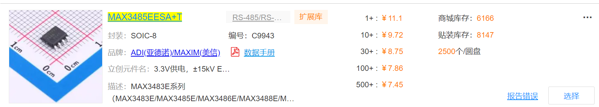
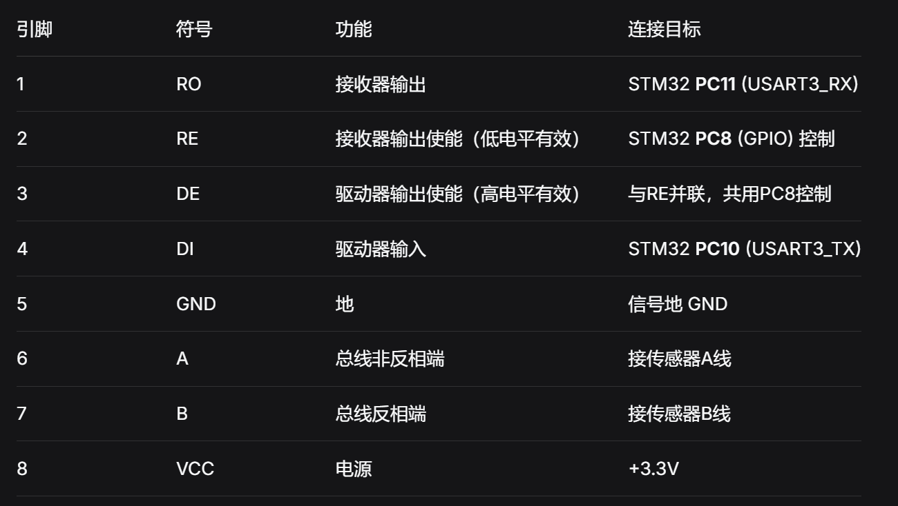
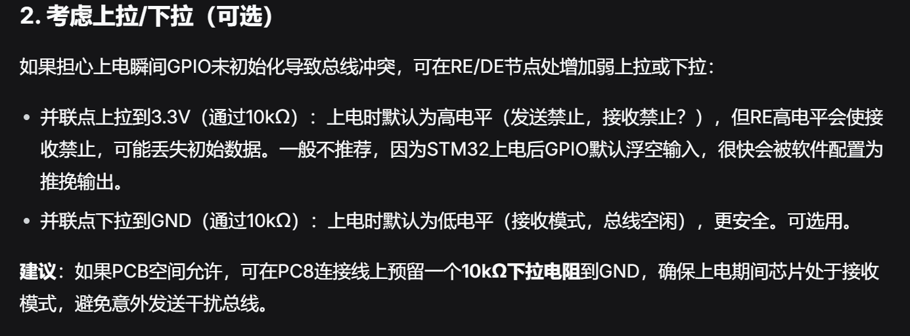
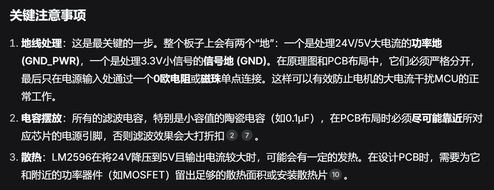

# 对本次试题的一些思考

## 序

​	首先很荣幸能够通过嘉立创EDA AI4EDA 岗位简历初选，当时只是抱着试一试的态度投了简历，没想到怎么快就收到参加复试的邮件，开心。这可是嘉立创啊！我相信每一位参与大学生电子类竞赛的学生都对嘉立创十分熟悉，而能够参与到嘉立创的开发更是梦想。

​	说来也巧，最近刚好要帮学弟设计他们机械创新大赛的PCB，就着本次试题，我就顺便一起做了，提前说明，对于这次PCB原理图设计，我将自己定位成一个什么都不懂的小白，完全将AI当作外置大脑，几乎都听他的，发现目前阶段下，deepseek还是能力不足的，这体现在很多方面（后文详谈），我参考他的建议设计出来的原理图只能说勉强一用，有很多地方有一些小问题，但不是说deepseek就完全没用，在和他交流过程中还是给了我不少惊喜（后文详谈）

## Deepseek设计的问题

> 1. 库的严重缺失
> 2. 端点连接描述模糊
> 3. 难以根据实际情况设计原件外围电路（也可能是我描述的不清楚）

​	库的严重缺失主要体现在各种原件的选型，deepseek找到的元件大多数来自于网络搜索（知乎，搜狐，B站甚至人民头条），deepseek对于这些元件的了解不够专业深入，使用方式也是简单粗暴的参考示例电路（虽然我也是）；其次，deepseek提供的元件名字有很多纰漏，同一种元件有很多型号适应不同的场景但他全部搞混了；
​	对于一名成熟的PCB设计师，一般都会有自己的库，针对某些功能常常会使用同一种元件，比如我习惯MAX3485EESA+T作为RS485通信芯片；而deepseek的元件库中如果找不到这个元件，就需要我手动导入数据手册给他分析。

​	端点连接描述模糊，在设计RS485通信部分，deepseek告诉我“与RE并联，共用PC8控制”，这句话在小白眼里就很懵，怎么并联，要外接电阻吗，直接连接会出问题吗？

​	于是我继续追问，果不其然

# deepseek设计的亮点

> 1. 会提出PCB布线上的建议，且可取之处很多
> 2. 阅读数据手册详细，有了充足的资料后，设计更加符合实际

​	本次设计过程中由于高压（24V）电路，deepseek做了功率地（PGND）和信号地（AGND）的区分，涉及大量电容电阻以及隔离和保护，deepseek在生成原理图设计后都附上了布线注意事项，并且告诉我“电容应该尽量靠近某某引脚”，这对初学者有很大的教学作用

# 总结

​	经过本次试题，我最大的收获就是知道了嘉立创为啥要搞这个AI设计，为啥要将AI引入硬件设计。因为现在AI的发展确实快的离谱，我大一入学的时候要是能有现在的deepseek辅助设计，或许可以少走不少弯路，尤其可以少熬几次夜（硬件出故障，调试信号），少烧几块板（没做隔离，供电设计不行），少掉几根头发......

​	试想，一个接入嘉立创元件库的超级deepseek，帮我设计电路，结合嘉立创那么多电子工程师的设计经验，最后的PCB肯定一次点亮，省下打板卷。
​	最后，其实我之前试用过华秋的AI插件KiCad（他们没有立创eda），不好用，加载太慢了

​	所以嘉立创招我吧，让我助力嘉立创打爆华秋，立创AI牛逼！！!